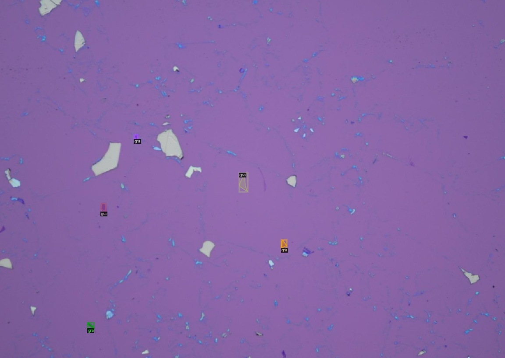
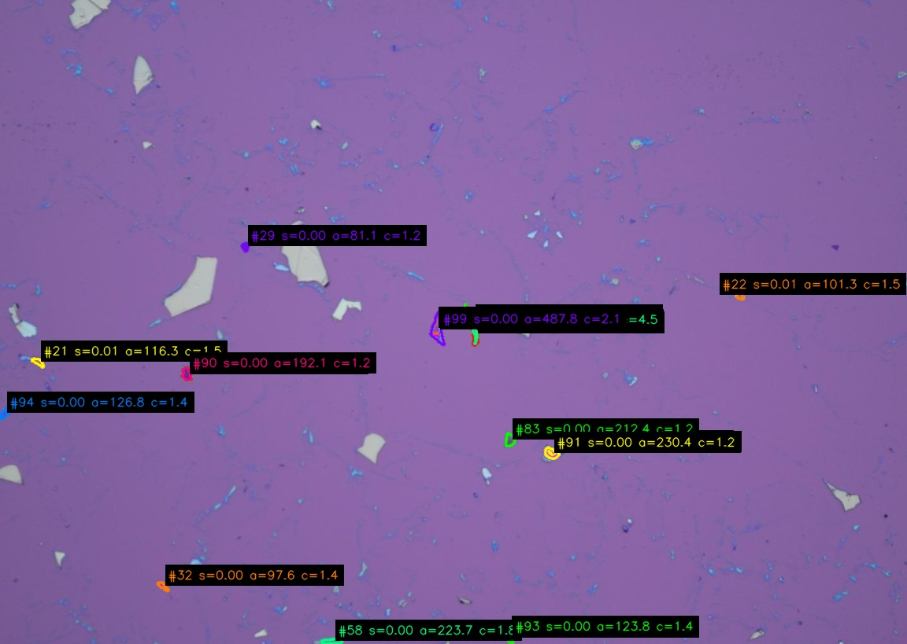
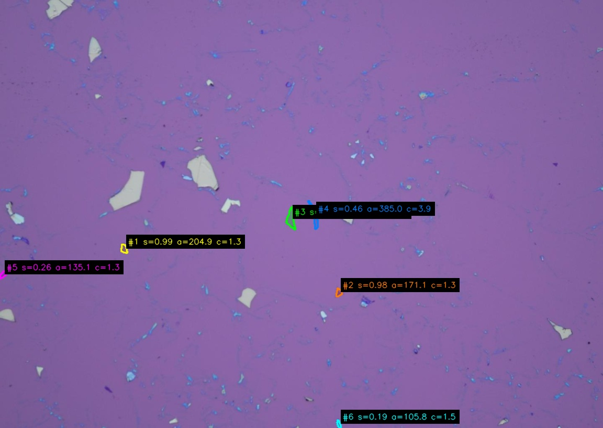

# 本科生毕业设计（论文）

题目：基于显微图像的石墨烯薄片自动分割与层数识别方法研究

姓名：________

学号：________

系别：物理系

专业：________

指导教师：________

年  月  日

## 诚信承诺书

本人郑重承诺所呈交的毕业设计（论文），是在导师的指导下，独立进行研究工作所取得的成果。除文中已经注明引用的内容外，本论文不包含任何其他人或集体已经发表或撰写过的作品或成果。对本论文研究作出重要贡献的个人和集体，均已在文中以明确方式标明。

作者签名：

年  月  日

# 基于显微图像的石墨烯薄片自动分割与层数识别方法研究

作者：________

（南方科技大学 物理系  指导教师：________）

## 摘要

石墨烯的层数、堆垛方式和局部形貌会显著影响其能带结构、光学响应与输运性质，因此在二维材料器件制备中，快速、稳定地从光学显微图像中找到目标薄片并判断层数具有重要意义。传统方法通常依赖人工显微镜筛选，再结合 Raman 光谱或 AFM 进行确认，虽然精度较高，但通量低、主观性强，难以满足大批量样品筛选需求。近年来，基于深度学习的二维材料识别方法开始被用于自动检测 flake，其中 MaskTerial 使用 Mask2Former 实例分割网络和光学对比度分类模块实现了较强的跨材料适配能力，为本文的分割模型提供了重要基础。

本文围绕石墨烯光学显微图像中的 flake 自动识别与层数判定展开。首先，在 MaskTerial/Mask2Former 分割框架基础上，针对石墨烯显微图像中低对比度、小碎块和重复预测等问题，调整模型候选数、no-object 权重和训练策略，并设计后处理流程，对重叠或包含的预测 mask 进行合并，对低置信度、小面积和形状复杂度过高的预测进行过滤，使分割结果更接近人工标注。其次，针对传统 green-channel contrast 方法受显微镜白平衡、背景不均匀和样品局部不均匀影响较大的问题，本文构建了局部背景校正的特征提取流程，并以加权线性回归作为 baseline。最后，本文提出 compact green ordinal boundary BCE 层数识别模型，将 green-channel contrast、flake 内部 contrast 分布宽度和白平衡参数共同输入一个小参数量的有序边界模型，直接优化相邻层数边界的判别。

实验结果表明，改进后的分割训练和后处理流程在测试集上的分割 AP50 从 53.03 提升到 65.90，AP 从 33.92 提升到 46.01。层数识别方面，1-3 层 WLS baseline 的 test exact accuracy 达到 86.2%，within-1 accuracy 达到 100%，说明本文的预处理和白平衡校正能够复现文献中 green-channel contrast 对低层石墨烯有效的结论。在 1-7 层任务上，WLS baseline 的 test exact accuracy 为 75.4%，本文 ordinal boundary BCE 模型提升到 84.2%，within-1 accuracy 达到 98.2%；当 WLS baseline 扩展到 1-9 层时，test exact accuracy 降至 64.8%，并且训练集 self-fit accuracy 仅为 50.9%，说明单一线性拟合在高层段存在明显欠拟合。本文 ordinal boundary BCE 模型在 1-9 层任务上仍取得 77.5% exact accuracy 和 98.6% within-1 accuracy。考虑到光学标注本身存在一定不确定性，结果说明本文方法能够在小数据条件下将 green-channel 层数识别从低层范围拓展到更高层数范围。

关键词：石墨烯；二维材料；显微图像；实例分割；MaskTerial；光学对比度；层数识别

## ABSTRACT

The layer number, stacking order and local morphology of graphene strongly affect its band structure, optical response and transport properties. Therefore, fast and reliable flake detection and layer identification from optical microscope images are important for the fabrication of two-dimensional material devices. Conventional workflows rely on manual optical inspection followed by Raman spectroscopy or AFM confirmation. These methods are accurate but time-consuming and difficult to scale. Recent deep-learning methods, especially MaskTerial based on Mask2Former instance segmentation and contrast-based classification, provide a foundation for automated flake detection.

This thesis studies automatic graphene flake segmentation and layer recognition from optical microscope images. Based on the MaskTerial/Mask2Former framework, the segmentation pipeline is adapted to graphene images by reducing the number of object queries, increasing the no-object loss weight, adjusting the training schedule and introducing a post-processing procedure. The post-processing merges duplicated masks and filters predictions with low confidence, small area or high shape complexity. For layer recognition, a local green-channel feature extraction pipeline is designed to reduce the influence of non-uniform background and microscope white balance. A weighted linear regression model is first used as a baseline. Then, a compact ordinal boundary BCE model is proposed, which uses green-channel contrast, intra-flake contrast variation and white-balance parameters to directly optimize ordered layer boundaries.

Experiments show that the improved segmentation pipeline increases AP50 from 53.03 to 65.90 and AP from 33.92 to 46.01 on the test set. For layer recognition, the 1-3 layer WLS baseline reaches 86.2% exact accuracy and 100% within-one-layer accuracy, confirming that the green-channel contrast feature can be reproduced for low-layer graphene after local background and white-balance correction. On the 1-7 layer task, the WLS baseline reaches 75.4% exact accuracy, while the proposed ordinal boundary BCE model reaches 84.2% exact accuracy and 98.2% within-one-layer accuracy. When the WLS baseline is extended to the 1-9 layer task, its test exact accuracy drops to 64.8%, and its training self-fit accuracy is only 50.9%, indicating clear underfitting in the high-layer regime. On the same 1-9 layer task, the proposed model still reaches 77.5% exact accuracy and 98.6% within-one-layer accuracy. These results indicate that the proposed method extends green-channel-based layer recognition from the low-layer regime to a wider layer range.

Keywords: graphene; two-dimensional materials; optical microscopy; instance segmentation; MaskTerial; optical contrast; layer recognition

## 目录

1. 绪论1.1 研究工作的背景和意义1.2 国内外研究现状1.3 主要研究内容1.4 论文结构组织
2. 石墨烯物理与光学识别基础2.1 石墨烯结构与层数相关性质2.2 光学显微成像与 green-channel contrast2.3 数据集与标注格式
3. 模型与方法3.1 MaskTerial 与 Mask2Former 分割框架3.2 本文的石墨烯分割改进3.3 Green-channel WLS baseline3.4 Compact ordinal boundary BCE 层数识别模型
4. 实验设计与结果分析4.1 实验设置与评价指标4.2 分割实验结果4.3 分割可视化分析4.4 层数识别实验结果4.5 误差来源与讨论
5. 总结与研究展望
   5.1 总结
   5.2 研究展望

参考文献
致谢

# 1. 绪论

## 1.1 研究工作的背景和意义

石墨烯是由碳原子以 sp2 杂化形成的二维蜂窝状晶格材料。单层石墨烯具有线性色散关系、高载流子迁移率、高机械强度和较强的光学透过率，是二维材料物理和纳米器件研究中的基础材料之一。随着层数增加，石墨烯逐渐从单层 Dirac 费米子体系过渡到少层石墨烯和类石墨体系，其电子能带、光学吸收、层间耦合和输运性质都会发生变化。对于双层和多层石墨烯，不同堆垛方式也会带来不同的物性，例如 AB 堆垛、ABC 堆垛以及扭转角引入的 moire 超晶格都可能导致新的低能电子结构。因此，在实验制备过程中，仅仅找到一片“石墨烯”是不够的，还需要进一步判断其层数和局部均匀性。

在二维材料器件制备中，机械剥离仍然是获得高质量石墨烯的重要方法。该方法能够产生晶体质量较高的薄片，但其随机性很强，同一张衬底上会同时出现不同层数、不同尺寸和不同形貌的 flake。实验人员通常需要在光学显微镜下反复扫描衬底，凭借颜色、对比度和形状经验筛选目标区域，再使用 Raman 光谱、AFM 或电学测量进行确认。这个流程的主要问题是人工筛选耗时较长，并且判断标准依赖显微镜光源、相机白平衡、衬底厚度和实验人员经验。对于需要大批量制备异质结、筛选少层样品或进行统计实验的研究而言，人工筛选会成为明显瓶颈。

因此，建立一个能够从显微镜图像中自动分割石墨烯 flake，并进一步给出层数预测的系统具有实际价值。自动分割可以减少人工搜索时间，层数识别可以提高后续 Raman 或 AFM 表征的效率。本文的目标不是完全替代高精度表征，而是构建一个适合实验室日常筛片的高通量预筛选工具：对可见 flake 给出 mask，对 1-7 层或 1-9 层范围给出层数预测，对不确定样本标记为需要人工复核。

## 1.2 国内外研究现状

石墨烯层数识别最直接的方法是 Raman 光谱和 AFM。Raman 光谱可以通过 G 峰、2D 峰位置、强度和线宽变化判断层数及缺陷情况；AFM 可以直接给出厚度和形貌信息。这些方法准确可靠，但需要逐点测量，时间成本高，不适合作为显微镜大范围扫描阶段的主工具。

另一类方法基于光学显微图像。由于石墨烯和 SiO2/Si 衬底之间存在薄膜干涉效应，不同层数会在 RGB 通道中表现出不同光学对比度。早期研究表明，合适氧化层厚度下单层和少层石墨烯可以直接在光学显微镜中观察到。后续工作进一步使用 green channel contrast 或 RGB contrast 对 1-3 层石墨烯进行经验判别。该方法速度快、设备要求低，但对显微镜参数、白平衡、照明均匀性和相机响应十分敏感，不同实验室之间很难直接复用同一套阈值。

近年来，深度学习方法开始被用于二维材料自动识别。MaskTerial 提出了一个面向二维材料 flake detection 和 classification 的基础模型框架。该工作使用改进的 Mask2Former 实例分割网络检测 flake，并结合基于 optical contrast 的 AMM/GMM 分类模块进行材料或厚度分类；同时通过合成数据预训练和少量真实数据 fine-tuning 提高模型对新材料的适配能力。MaskTerial 为本文提供了重要基础：一方面，其 Mask2Former 分割框架适合从复杂显微图像中提取 flake mask；另一方面，原始分类模块主要面向粗粒度或数据集定义的类别，本文需要针对石墨烯 1-7 层和 1-9 层进行更精细的层数识别，因此需要重新设计层数模型。

## 1.3 主要研究内容

本文主要完成以下工作。

第一，基于 MaskTerial/Mask2Former 框架训练石墨烯 flake 分割模型。针对本文数据中低对比度、小块和重复预测较多的问题，对原始配置进行修改，包括减少 object query 数量、提高 no-object 分类权重、调整 batch size、学习率和训练迭代策略。模型输出后进一步进行后处理，合并重复或包含关系明显的 mask，并过滤低置信度、小面积和形状复杂度过高的预测。

第二，构建 green-channel 层数识别 baseline。对每个 flake 的局部区域进行背景估计与校正，提取 normalized green-channel contrast 和白平衡参数，训练 class-balanced weighted least squares 回归模型，作为后续方法的对照组。

第三，提出 compact ordinal boundary BCE 层数识别模型。该模型只使用少量物理相关特征，包括 normalized delta G、flake 内部 contrast IQR 和白平衡参数。模型输出一个连续 score，并通过有序边界判断层数。损失函数直接优化每个相邻层数边界，从而更适合层数这种有序离散标签。

第四，搭建 segmentation + layer recognition 推理流程。输入显微镜图片文件夹后，系统先进行 flake segmentation，再对每个 mask 提取 green-channel 特征并预测层数，最终输出带层数标签的 COCO segmentation 文件和审计 CSV。

## 1.4 论文结构组织

本文共分为五章。第一章介绍研究背景、相关工作和本文主要内容。第二章介绍石墨烯层数与堆垛相关物理性质，以及光学显微图像中 green-channel contrast 的来源。第三章介绍 MaskTerial/Mask2Former 分割框架、本文分割改进、WLS baseline 和 compact ordinal boundary BCE 层数识别方法。第四章给出实验设置、分割结果、层数识别结果和误差分析。第五章总结本文工作，并讨论未来可改进方向。

# 2. 石墨烯物理与光学识别基础

## 2.1 石墨烯结构与层数相关性质

单层石墨烯由一个原子层厚度的碳原子蜂窝晶格组成，其低能电子结构可在 K 和 K' 谷附近近似为线性色散，因此常被用作研究二维 Dirac 费米子输运的模型体系。随着层数增加，层间耦合会改变能带结构。例如 AB 堆垛双层石墨烯具有不同于单层的低能色散，并可以通过外加垂直电场调控能隙；三层及以上石墨烯还可能出现 ABA、ABC 等不同堆垛方式，不同堆垛会带来不同的低能态密度、光学响应和输运行为。也就是说，层数和堆垛不是简单的形貌描述，而是决定器件物理性质的重要自由度。

这一点在摩尔超晶格器件中尤其明显。将两层石墨烯或石墨烯与其他二维材料按特定角度堆叠时，晶格失配或扭转角会形成长周期摩尔势，进而重构能带并诱导关联绝缘态、超导、异常霍尔效应等低温量子输运现象。课题组的研究方向也集中在低维材料及其异质结中的量子输运、拓扑量子物态、磁性、非常规超导和新奇异质结界面等问题[10]。在这类实验中，石墨烯薄片可能作为主要输运通道、接触电极、局域栅极或异质结中的关键层，其层数、面积、边界质量和洁净程度都会影响器件加工与最终测量。

在自旋输运相关研究中，石墨烯也具有重要作用。由于碳元素自旋轨道耦合较弱、核自旋背景较低，高质量石墨烯可以作为较长自旋弛豫长度的二维输运通道；同时，通过与磁性材料、强自旋轨道耦合材料或超导材料构成异质结，又可以研究邻近效应诱导的自旋、谷和拓扑输运现象。因此，在器件制备前快速找到合适层数和尺寸的石墨烯 flake，是后续微纳加工和低温输运测量的基础步骤。本文的图像识别工作并不直接测量这些量子输运现象，而是服务于样品制备前端：从显微图像中更高效地筛选出可能用于摩尔超晶格器件或自旋输运器件的候选薄片。

## 2.2 光学显微成像与 green-channel contrast

石墨烯虽然只有原子层厚度，但在 SiO2/Si 衬底上可以通过光学显微镜观察到。这主要来自石墨烯、SiO2 层和 Si 衬底之间的多层薄膜干涉。不同层数会改变反射光强，使 flake 区域与裸衬底区域在 RGB 通道中出现微弱但可测的对比度。

本文使用 green channel 作为层数识别的主要光学信号。对一个 flake，记背景校正后的 flake green intensity 为 \(G_{\mathrm{flake}}\)，局部背景 green intensity 为 \(G_{\mathrm{bg}}\)，则 normalized delta G 定义为

\[
\mathrm{ndg}=\frac{\Delta G}{G_{\mathrm{bg}}}
=\frac{G_{\mathrm{flake}}-G_{\mathrm{bg}}}{G_{\mathrm{bg}}}.
\]

在理想情况下，少层石墨烯的 \(\mathrm{ndg}\) 会随层数单调变化，因此可以用作层数判别特征。但是实际显微图像中存在三个问题。第一，不同拍摄设置会改变 white balance，导致同一层数的 contrast 发生整体偏移。第二，视野内照明并不完全均匀，背景可能存在缓慢变化。第三，flake 内部可能存在褶皱、污染或厚度不均匀，使单个平均值不能完全代表该 flake。因此，本文在使用 green-channel contrast 时同时加入白平衡参数和 flake 内部 contrast 分布宽度。

## 2.3 数据集与标注格式

本文使用 COCO segmentation 格式保存石墨烯显微图像标注。分割任务中，每个 annotation 对应一个 flake mask；层数任务中，category name 对应真实层数。白平衡信息由图片名解析得到，文件名前部数字块被转换为两个白平衡参数 \(wb1\) 和 \(wb2\)。例如，当图片名中前四个数字块可解析为 \(a,b,c,d\) 时，代码将其转为 \(wb1=a.b\)，\(wb2=c.d\)。

当前层数数据中 1-9 层数据较完整，但 5 层缺失。因此，对于监督训练，模型实际使用的类别为 \([1,2,3,4,6,7]\) 或扩展后的 \([1,2,3,4,6,7,8,9]\)。5 层不作为已监督学习到的类别。在推理时，5 层根据 4 层和 6 层 score median 进行插值，作为待人工复核的候选区间。这样的处理避免了把缺失标签误写成已经验证过的分类结果。

# 3. 模型与方法

## 3.1 MaskTerial 与 Mask2Former 分割框架

MaskTerial 是面向二维材料显微图像的自动 flake detection 和 classification 框架。其核心思想是将 flake 搜索拆成两个阶段：第一阶段用实例分割模型检测 flake mask，第二阶段对每个 flake 计算 optical contrast 并进行材料或厚度分类。该框架的分割部分基于 Mask2Former。Mask2Former 将图像特征输入 pixel decoder 和 transformer decoder，通过一组 object queries 预测 mask embedding 和类别概率。与传统逐像素 semantic segmentation 不同，Mask2Former 直接输出实例级 mask，因此适合处理一张显微图像中多个 flake 的情况。

训练时，Mask2Former 使用 Hungarian matching 将预测 query 与真实 mask 一一匹配。匹配后的损失包含分类交叉熵、mask binary cross entropy 和 dice loss。未匹配 query 被视为 no-object。对于本文的石墨烯数据，许多显微镜视野中真实 flake 数量并不多，如果 object query 数过大，模型容易产生大量低质量重复候选；如果 no-object 权重过低，模型对无效候选的惩罚不足。因此，本文的分割改进首先从 query 数和 no-object 权重入手。

MaskTerial 原始框架还包含 AMM/GMM 分类头，用于根据 optical contrast 对 flake 做粗分类。本文曾尝试将层数数据重标为低层、中层、厚层三类并训练 AMM/MLP 粗分类模型，但结果显示 AMM 对低层召回不足，MLP 虽然能较好地区分 low-vs-rest，但中层与厚层仍有明显混淆。因此，本文最终不采用 AMM 粗分类作为层数识别主方法，而是保留 Mask2Former 作为分割基础，并单独设计 green-channel ordinal layer recognition。

## 3.2 本文的石墨烯分割改进

本文使用的 baseline config 为 `configs/M2F/config_baseline.yaml`，改进 config 为 `configs/M2F/base_config.yaml`。两者的关键差异见表 3-1。

表 3-1 分割配置主要差异

| 参数                   |  baseline |       本文改进 | 作用                                                               |
| ---------------------- | --------: | -------------: | ------------------------------------------------------------------ |
| `NUM_OBJECT_QUERIES` |       100 |             20 | 减少无效候选和重复预测，使 query 数更接近单张图像中实际 flake 数量 |
| `NO_OBJECT_WEIGHT`   |       0.1 |            0.4 | 增强对 no-object query 的惩罚，降低低质量假阳性                    |
| `IMS_PER_BATCH`      |        16 |             32 | 提高训练 batch size，改善梯度估计稳定性                            |
| `BASE_LR`            |      1e-5 |           5e-5 | 在 fine-tuning 中提高学习率，加快适配                              |
| `MAX_ITER`           |     12000 |          12000 | 增加训练迭代数                                                     |
| LR scheduler           | no warmup | WarmupCosineLR | 前期 warmup，后期平滑下降                                          |

模型直接输出的 mask 仍可能存在重复、包含、小碎片和形状异常等问题。因此，本文加入了基于规则的后处理。第一，对两个预测 mask 计算 IoU 和 containment。如果 IoU 大于 0.5，或者较小 mask 被较大 mask 覆盖比例超过 0.8，则认为二者是同一 flake 的重复预测，并进行 union 合并。第二，对最终 flake 进行过滤：score 需要大于 0.015，面积需要大于 100 \(\mu m^2\)，形状复杂度需要小于 5.0。形状复杂度定义为

\[
C=\frac{P^2}{4\pi A},
\]

其中 \(P\) 是 mask 周长，\(A\) 是 mask 面积。圆形或紧凑形状的 \(C\) 接近 1，细长、破碎或边界极不规则的预测会得到更大的 \(C\)。这一指标可以过滤由噪声、边缘伪影或错误分割产生的碎片。

图 3-1 给出了同一张测试图像在手工标注、原配置预测和改进配置加后处理预测下的可视化对比。手工标注中，图像内主要标出了少数肉眼可辨认且形状相对完整的石墨烯 flake。原配置预测结果中，模型输出了大量低置信度小色块，多个预测 mask 彼此接近或重叠，且存在一些面积很小、形状破碎的候选区域。这类输出虽然在数值上可能包含部分真实 flake，但对实际筛片并不友好，因为实验人员仍需要从大量噪声候选中手动判断有效样品。改进配置和后处理后的结果明显减少了碎片化预测和重复预测，保留的 flake 数量与手工标注更接近，且主要集中在较清晰的候选区域。该对比直观说明，减少 object query、提高 no-object 权重以及后处理过滤共同提高了分割结果的可用性。

图 3-1 石墨烯分割可视化对比

| 手工标注 | 原配置预测 | 改进配置 + 后处理 |
| --- | --- | --- |
|  |  |  |

## 3.3 Green-channel WLS baseline

为了建立可解释的对照组，本文首先实现 green-channel weighted least squares baseline。其特征提取与后续 ordinal model 使用同一套预处理流程，保证比较公平。对每个 flake，先根据 bbox 外扩得到局部 ROI，再排除所有标注 flake mask 及其 dilation 区域，得到背景候选像素。对背景 green channel 使用双边滤波，并在背景候选中寻找主峰附近像素，拟合一阶背景平面

\[
G_{\mathrm{bg}}(x,y)=ax+by+c.
\]

为了降低杂质或其他 flake 对背景拟合的影响，背景平面拟合使用 residual sigma clipping。先拟合一次平面，计算 residual，再删除偏离中位 residual 超过若干倍 robust sigma 的背景点，重复迭代后得到更稳定的背景估计。

对于 flake 区域，本文比较了 peak、median、trimmed median、central median 和 largest inner median 等代表值。最终 baseline 使用 largest inner median，即先对 flake mask 腐蚀，取内部最大连通区域，再计算背景校正后 green residual 的中位数。该方法可以减少边缘混合像素和局部噪声的影响。

WLS baseline 使用的输入特征为

\[
x=[\mathrm{ndg}_{\mathrm{largest\_inner\_median}}, wb1].
\]

回归模型为

\[
\hat{y}=\beta_0+\beta_1 \mathrm{ndg}_{\mathrm{largest\_inner\_median}}+\beta_2 wb1.
\]

训练时使用 class-balanced sample weight，以减弱不同层数样本量不均衡的影响。预测时得到连续 score，再映射到最近的有效层数。

## 3.4 Compact ordinal boundary BCE 层数识别模型

WLS baseline 的优点是简单、可解释，但它本质上优化连续层数数值的均方误差。对于层数分类任务，score 靠近真实层数并不一定代表边界判别正确。例如真实层数为 3 时，score 为 3.45 和 3.55 在 MSE 上差别不大，但如果 3/4 边界位于二者之间，则会导致完全不同的分类结果。因此，本文将层数识别重新表述为有序边界判别问题。

模型输入四个基础特征：

\[
x=[\mathrm{ndg},\mathrm{iqr\_ndg},wb1,wb2].
\]

其中

\[
\mathrm{iqr\_ndg}=\frac{P_{90}(G_{\mathrm{flake}}-G_{\mathrm{bg}})-P_{10}(G_{\mathrm{flake}}-G_{\mathrm{bg}})}
{|G_{\mathrm{bg}}|}.
\]

`iqr_ndg` 描述 flake 内部 contrast 分布宽度，可反映厚度不均匀、污染或边缘混入带来的不确定性。对训练集拟合均值和标准差后，输入特征被标准化为

\[
z=\frac{x-\mu_{\mathrm{train}}}{\sigma_{\mathrm{train}}}.
\]

然后构造固定的 7 维特征映射：

\[
\phi(x)=
[z_{\mathrm{ndg}},
z_{\mathrm{ndg}}^2,
z_{\mathrm{iqr}},
z_{wb1},
z_{wb2},
z_{\mathrm{ndg}}z_{wb1},
z_{\mathrm{ndg}}z_{wb2}].
\]

其中 \(z_{\mathrm{ndg}}^2\) 允许 green contrast 与层数之间存在轻微非线性，交互项 \(z_{\mathrm{ndg}}z_{wb1}\) 和 \(z_{\mathrm{ndg}}z_{wb2}\) 用来描述白平衡对 contrast 斜率的调制。

模型输出共享连续 score：

\[
s_i=w^T\phi(x_i)+b.
\]

对于有效类别 \([1,2,3,4,6,7]\)，定义有序边界 \([2,3,4,6,7]\)。每个边界 \(B_j\) 表示 \(y\ge b_j\)。边界 logit 为

\[
a_{ij}=s_i-\theta_j.
\]

真实标签被转为 boundary targets：

\[
t_{ij}=
\begin{cases}
1, & y_i\ge b_j,\\
0, & y_i<b_j.
\end{cases}
\]

训练损失为 margin ordinal BCE：

\[
L=
\frac{1}{N}\sum_i \omega_{y_i}
\sum_j \lambda_j
\left[
t_{ij}\operatorname{softplus}(m-a_{ij})
+(1-t_{ij})\operatorname{softplus}(a_{ij}+m)
\right]
+\gamma ||w||^2.
\]

其中 \(\omega_y\) 是 class-balanced sample weight，\(\lambda_j\) 是边界权重，\(m\) 是 margin，\(\gamma\) 是 L2 正则化强度。该损失的含义是：如果样本应该跨过某个边界，则希望 \(a_{ij}>m\)；如果样本不应该跨过该边界，则希望 \(a_{ij}<-m\)。当预测错得更远时，会跨错更多边界，因此损失自然增大。

为了保证阈值顺序合法，模型不直接优化 \(\theta_j\)，而是优化 raw 参数，并通过 softplus gap 生成单调递增阈值：

\[
\theta_1=r_0,\quad
\theta_j=\theta_{j-1}+\operatorname{softplus}(r_{j-1})+\epsilon.
\]

预测时统计 score 跨过的边界数，并映射回有效层数。对于缺失的 5 层，不参与训练；推理阶段可根据 4 层和 6 层 train score median 进行线性插值，作为复核区间。

# 4. 实验设计与结果分析

## 4.1 实验设置与评价指标

分割实验使用石墨烯 COCO segmentation 数据集，baseline config 为 `configs/M2F/config_baseline.yaml`，改进 config 为 `configs/M2F/base_config.yaml`。评价指标采用 COCO segmentation AP、AP50、AP75，并按 flake 面积分区统计。由于本文关注实验室筛片场景，AP50 和可视化结果对实际使用更直观。

层数识别实验使用 `white_balance_copy_layers.v10-argmented-10x.coco-segmentation` 数据集。1-7 层 ordinal 模型对应输出目录 `training_log/green_ordinal_largest_inner_median_v10`；1-9 层 ordinal 模型对应输出目录 `training_log/green_ordinal_largest_inner_median1_9`；1-3 层 WLS baseline 对应 `training_log/wls_baseline_largest_inner_wb1_1_3`；1-7 层 WLS baseline 对应 `training_log/wls_baseline_largest_inner_wb1_v10`；1-9 层 WLS baseline 对应 `training_log/wls_baseline_largest_inner_wb1_1_9`。评价指标包括 exact accuracy、within-1 accuracy、MAE、macro-F1、large error rate 和 review rate。

## 4.2 分割实验结果

表 4-1 给出了已有分割实验统计。`graphene_mid_finetune_v2` 可作为早期 fine-tuning 结果；`remove_small_flakes_and_blur_image` 和 `graphene_mid_finetune_penalize_small_flakes` 代表后续针对小块和训练策略的改进版本。

表 4-1 分割实验指标

| 实验目录                                        |    AP |  AP50 | AP(0-100) | AP50(0-100) | AP(100-200) | AP50(100-200) | AP(400+) | AP50(400+) |
| ----------------------------------------------- | ----: | ----: | --------: | ----------: | ----------: | ------------: | -------: | ---------: |
| `graphene_mid_finetune_v2`                    | 33.92 | 53.03 |      8.28 |       16.11 |       53.21 |         80.31 |    67.75 |      92.82 |
| `remove_small_flakes_and_blur_image`          | 46.01 | 65.90 |     28.08 |       44.70 |       52.18 |         78.07 |    62.04 |      78.19 |
| `graphene_mid_finetune_penalize_small_flakes` | 45.53 | 65.28 |     16.33 |       28.70 |       53.57 |         76.37 |    66.79 |      84.24 |

从表中可以看到，改进后的训练方案使整体 AP50 从 53.03 提升到 65.90，AP 从 33.92 提升到 46.01。对于小面积 flake，AP50(0-100) 从 16.11 提升到 44.70，说明模型对小目标的召回和 mask 定位能力有明显改善。对于大面积 flake，原模型本身 AP50 已较高，但改进后在过滤碎片和重复预测方面更稳定。

本文在图 3-1 中选取 `baseline_raw_no_postprocess` 中的一张原配置可视化结果，与对应手工标注和改进配置加后处理结果进行对比。正式论文中如果进一步重新生成全量 baseline 可视化，可继续补充更多同图对照；当前分割定量结论仍以表 4-1 的 AP/AP50 指标为准。

## 4.3 分割可视化分析

改进后可视化结果位于 `training_log/eval_vis/modified_config/post_final_test`。该目录中每张图片包含人工标注 `*_gt.jpg` 和预测结果 `*_pred.jpg`。从可视化观察，改进后的模型能够较好捕捉肉眼可见的石墨烯 flake，尤其是边界较清晰、面积较大的 flake。后处理对重复 mask 的合并和小碎片过滤也使输出更接近人工标注。

图 3-1 已展示同一张图像的手工标注、baseline raw prediction 和 improved postprocessed prediction。该可视化结果显示，原配置输出包含较多小碎片和重复预测，而改进配置加后处理后保留的候选区域更接近手工标注。

图 4-2 可展示后处理各阶段结果：raw prediction、overlap merged、bridge merged、final result。对应文件位于 `training_log/eval_vis/modified_config/post_debug_test`。如果最终实验未启用 bridge merge，则正文需要说明 bridge stage 仅为调试可视化，主结果主要来自 overlap merge 与 final filtering。

## 4.4 层数识别实验结果

表 4-2 给出了 WLS baseline 与本文 ordinal boundary BCE 模型在测试集上的对比。

表 4-2 层数识别测试集指标

| 模型         | 类别范围        |  n | Exact Acc. | Within-1 Acc. |   MAE | Macro-F1 | Large Error Rate | Review Rate |
| ------------ | --------------- | -: | ---------: | ------------: | ----: | -------: | ---------------: | ----------: |
| WLS baseline | 1,2,3           | 29 |      86.2% |        100.0% | 0.138 |    0.857 |            0.00% |           - |
| WLS baseline | 1,2,3,4,6,7     | 57 |      75.4% |         98.2% | 0.263 |    0.752 |            1.75% |           - |
| WLS baseline | 1,2,3,4,6,7,8,9 | 71 |      64.8% |         98.6% | 0.366 |    0.616 |            1.41% |           - |
| Ordinal BCE  | 1,2,3,4,6,7     | 57 |      84.2% |         98.2% | 0.175 |    0.842 |            1.75% |       15.8% |
| Ordinal BCE  | 1,2,3,4,6,7,8,9 | 71 |      77.5% |         98.6% | 0.239 |    0.772 |            1.41% |       18.3% |

首先，1-3 层 WLS baseline 在测试集上达到 86.2% exact accuracy 和 100% within-1 accuracy，说明在本文数据和预处理流程下，文献中利用 green-channel contrast 判断低层石墨烯的思路是可以复现的。也就是说，本文并不是否定 green-channel 特征本身；相反，实验表明经过局部背景拟合、largest-inner-median flake 代表值和白平衡参数校正后，green-channel contrast 对 1-3 层仍然是有效特征。

在 1-7 层任务上，本文 ordinal model 相比 WLS baseline 将 exact accuracy 从 75.4% 提升到 84.2%，MAE 从 0.263 降低到 0.175，macro-F1 从 0.752 提升到 0.842。within-1 accuracy 两者都达到 98.2%，说明 green-channel contrast 已经能够提供较好的大致层数排序，而 ordinal boundary BCE 进一步改善了相邻层数的边界判别。

当类别范围扩展到 1-9 层后，WLS baseline 的 exact accuracy 降至 64.8%，macro-F1 降至 0.616，明显低于 ordinal BCE 的 77.5% 和 0.772。更重要的是，1-9 WLS baseline 在训练集上的 self-fit exact accuracy 也只有 50.9%，within-1 accuracy 为 95.1%。这说明它的问题不是测试集过拟合或数据划分偶然性，而是单一线性函数无法同时拟合低层和高层的层数边界，即存在模型欠拟合。换言之，线性回归仍能保持较高 within-1 accuracy，是因为 \(\mathrm{ndg}\) 与层数总体仍近似单调；但它无法把高层相邻类别的 exact boundary 放到正确位置，因此不适合作为 1-9 层精确识别的最终模型。本文的主要改进正是在保留 green-channel 物理特征可解释性的基础上，将可用识别范围从传统低层范围扩展到至少 1-7 层，并在 1-9 层扩展实验中仍保持较好的识别能力。

该模型还提供 review flag。当样本 score 离任一边界过近，或者落入缺失 5 层插值区间时，模型会标记为需要人工复核。在 1-7 层模型中，review rate 为 15.8%；去掉 review 样本后，kept exact accuracy 达到 91.7%。这符合实验室应用需求：模型可以自动处理高置信样本，把低置信样本交给人工或 Raman/AFM 复核。

表 4-3 给出 1-9 层 WLS baseline 与 ordinal BCE 在高层段的测试集混淆情况。可以看到，WLS baseline 对真实 7 层完全失效：11 个真实 7 层样本没有任何一个被预测为 7 层，其中 7 个被低估为 6 层，3 个被高估为 8 层，1 个被高估为 9 层。相比之下，ordinal BCE 在真实 7 层上有 6/11 个预测正确，主要错误也集中在相邻的 6 层和 8 层。按 7-9 层高层段统计，WLS baseline 的 exact accuracy 为 \(11/25=44.0\%\)，ordinal BCE 为 \(16/25=64.0\%\)，提升 20 个百分点。这说明 ordinal BCE 明显缓解了线性模型在高层边界上的失效。

表 4-3 1-9 WLS baseline 与 ordinal BCE 高层段混淆统计

| 模型         | true layer | pred 6 | pred 7 | pred 8 | pred 9 |
| ------------ | ---------: | -----: | -----: | -----: | -----: |
| WLS baseline |          7 |      7 |      0 |      3 |      1 |
| WLS baseline |          8 |      0 |      1 |      4 |      2 |
| WLS baseline |          9 |      0 |      0 |      0 |      7 |
| Ordinal BCE  |          7 |      1 |      6 |      4 |      0 |
| Ordinal BCE  |          8 |      0 |      1 |      4 |      2 |
| Ordinal BCE  |          9 |      0 |      0 |      1 |      6 |

表 4-4 给出 1-7 层 ordinal BCE 模型的测试集混淆矩阵。

表 4-4 1-7 ordinal BCE 测试集混淆矩阵

| true layer | pred 1 | pred 2 | pred 3 | pred 4 | pred 6 | pred 7 |
| ---------: | -----: | -----: | -----: | -----: | -----: | -----: |
|          1 |      8 |      2 |      0 |      0 |      0 |      0 |
|          2 |      0 |      8 |      0 |      0 |      0 |      0 |
|          3 |      0 |      1 |     10 |      0 |      0 |      0 |
|          4 |      0 |      0 |      4 |      7 |      1 |      0 |
|          6 |      0 |      0 |      0 |      0 |      5 |      0 |
|          7 |      0 |      0 |      0 |      0 |      1 |     10 |

主要错误集中在 1/2、3/4 和 4/6 边界附近。其中 3/4 层混淆最明显，这与人工标注噪声和少层石墨烯 optical contrast 间隔较小有关。1-9 层模型的混淆矩阵进一步显示，7/8 和 8/9 之间也存在相邻层混淆，但几乎没有跨越两层以上的大错误。

表 4-5 给出训练集每层 score median。可以看到，随着层数增加，score 基本单调增大，说明模型学到的连续光学厚度分数具有合理物理含义。

| 模型            | layer 1 | layer 2 | layer 3 | layer 4 | layer 6 | layer 7 | layer 8 | layer 9 |
| --------------- | ------: | ------: | ------: | ------: | ------: | ------: | ------: | ------: |
| 1-7 Ordinal BCE |  -1.558 |   1.045 |   4.215 |   5.325 |  10.789 |  16.494 |       - |       - |
| 1-9 Ordinal BCE |  -3.577 |  -0.411 |   3.513 |   4.850 |  10.562 |  15.671 |  20.004 |  24.222 |

5 层由于当前训练集中没有标注样本，不参与监督训练。对于实际推理，本文仅根据 4 层和 6 层 score median 中间位置给出插值复核区间，不将其写成已验证类别。未来需要补充 5 层样本后重新训练，才能对 5 层 exact accuracy 做定量评价。

## 4.5 误差来源与讨论

本文方法的主要误差来源有四类。

第一，层数标注本身存在不确定性。许多样本的层数来自光学显微经验判断，而非逐个 flake 的 Raman 或 AFM 标定。对于 contrast 接近的相邻层数，人工标签可能也存在边界模糊。

第二，白平衡是强混杂变量。即使同一层数，显微镜白平衡变化也会改变 green-channel contrast。因此本文在特征中加入 \(wb1\)、\(wb2\) 及其与 ndg 的交互项。1-3 层 WLS baseline 的结果说明，经过白平衡校正后，green-channel contrast 在低层段确实具有可复现的判别能力；但仅使用线性回归时，exact boundary 在更宽层数范围内仍不够稳定。尤其是在 1-9 层任务中，WLS baseline 的训练集 self-fit exact accuracy 仅为 50.9%，说明该方法即使在训练数据上也无法同时拟合低层和高层的判别边界，属于模型形式受限导致的欠拟合。

第三，背景拟合会影响 ndg 精度。显微图像中可能存在照明梯度、污染、其他 flake 或拍摄噪声。如果背景区域选择不合理，拟合平面会偏向局部异常区域。本文使用 mask dilation、背景主峰筛选和 residual sigma clipping 来提升背景估计稳定性。

第四，高层石墨烯 optical contrast 的层间差异减小，并且层数与 green-channel contrast 的关系不再适合用单一直线描述。对于 7 层以上样本，层数增加带来的颜色变化不再像 1-4 层那样明显，7/8/9 层之间更容易混淆。WLS baseline 在 true 7 层上完全失效，说明高层段的边界位置不能由低层线性趋势简单外推。相比之下，ordinal BCE 模型通过 \(z_{\mathrm{ndg}}^2\)、white-balance 交互项和可学习有序阈值允许轻微非线性，因此在 1-9 层任务上仍能保持 77.5% exact accuracy 和 98.6% within-1 accuracy。由此可见，偏线性方法可以作为低层近似或 baseline，但不适合作为高层精确识别模型。

# 5. 总结与研究展望

## 5.1 总结

本文围绕石墨烯显微图像自动识别，完成了 flake segmentation 和 layer recognition 两部分工作。分割方面，本文以 MaskTerial/Mask2Former 为基础，对石墨烯数据进行 fine-tuning，并通过减少 object query 数、提高 no-object 权重、调整训练策略和设计后处理流程，提升了 flake mask 输出质量。实验结果显示，改进方案使测试集 AP50 从 53.03 提升到 65.90，AP 从 33.92 提升到 46.01。

层数识别方面，本文首先实现了基于 green-channel contrast 和白平衡参数的 WLS baseline。该 baseline 在 1-3 层任务上达到 86.2% exact accuracy 和 100% within-1 accuracy，证明本文的特征提取流程能够复现低层 green-channel contrast 判据；但该 baseline 在 1-7 层任务上下降到 75.4% exact accuracy，扩展到 1-9 层后 test exact accuracy 进一步降至 64.8%，训练集 self-fit accuracy 也只有 50.9%，说明单一直线拟合难以描述高层段的层数-contrast 关系。随后本文提出 compact ordinal boundary BCE 模型，将层数识别视为有序边界判别问题。该模型只使用少量物理相关特征，参数量小，适合当前样本量有限的数据集。在 1-7 层任务上，模型 test exact accuracy 达到 84.2%，within-1 accuracy 达到 98.2%；在 1-9 层任务上，exact accuracy 达到 77.5%，within-1 accuracy 达到 98.6%。这些结果说明，结合局部背景校正、白平衡建模和有序边界损失，可以在保留 green-channel 特征物理可解释性的同时，将可靠识别范围从低层拓展到更高层数。

## 5.2 研究展望

本文仍有若干不足。首先，当前 5 层样本缺失，因此模型不能对 5 层进行监督验证。未来应优先补充 5 层样本，并扩充 10 层以上数据，用于研究高层石墨烯的 optical contrast 非线性。其次，当前层数标签主要来自光学经验判断，未来应使用 Raman、AFM 或已知器件结果对关键样本进行校准，建立更可靠的 ground truth。第三，当前白平衡参数来自文件名解析，仍属于经验校正。未来可以设计标准参考区域或标准样品，实现跨显微镜的系统标定。第四，分割模型和层数模型目前是串联流程，未来可以进一步结合 segmentation uncertainty 和 layer recognition review flag，形成更完整的自动筛片软件。

总体而言，本文方法能够在现有实验室显微镜图像和有限标注数据条件下，实现石墨烯 flake 的自动分割，并在 1-7 层精确识别和 1-9 层扩展识别中取得优于线性 baseline 的结果，为二维材料制备流程自动化提供了可行基础。

# 参考文献

[1] Novoselov K S, Geim A K, Morozov S V, et al. Electric field effect in atomically thin carbon films[J]. Science, 2004, 306(5696): 666-669.

[2] Geim A K, Novoselov K S. The rise of graphene[J]. Nature Materials, 2007, 6: 183-191.

[3] Blake P, Hill E W, Castro Neto A H, et al. Making graphene visible[J]. Applied Physics Letters, 2007, 91: 063124.

[4] Novoselov K S, Mishchenko A, Carvalho A, Castro Neto A H. 2D materials and van der Waals heterostructures[J]. Science, 2016, 353(6298): aac9439.

[5] Cheng B, Misra I, Schwing A G, Kirillov A, Girdhar R. Masked-attention Mask Transformer for Universal Image Segmentation[C]. CVPR, 2022.

[6] Uslu O, et al. MaskTerial: A Foundation Model for Automated 2D Material Flake Detection[J]. Digital Discovery, 2025, 4: 3744. DOI: 10.1039/D5DD00156K.

[7] MaskTerial project repository and model zoo[EB/OL]. https://github.com/Jaluus/MaskTerial; https://zenodo.org/records/15765516.

[8] Green-channel contrast layer recognition reference. 本地文件：`green channel.pdf`。待补充完整作者、题名、期刊和年份。

[9] COCO dataset format and evaluation metrics. Microsoft COCO: Common Objects in Context[EB/OL]. https://cocodataset.org/.

[10] 南方科技大学物理系. 教师主页：刘畅[EB/OL]. https://phy.sustech.edu.cn/faculty/detail/id/4272.html?lang=zh-cn.

# 致谢

首先感谢指导教师在课题选择、实验思路和论文写作中的指导。感谢课题组同学在石墨烯样品制备、显微镜拍摄和层数标注中的帮助。感谢 MaskTerial 项目作者公开代码、模型和数据资源，使本文能够在已有二维材料自动识别框架基础上开展进一步改进。最后感谢家人和朋友在本科阶段给予的支持。

<!--
后续待办：
1. 重新生成真正无后处理的 baseline segmentation 可视化，再替换第 4 章图 4-1。
2. 从 maskterial.pdf 和 green channel.pdf 补全参考文献条目，并把引用编号插入正文。
3. 按学校 Word 模板调整标题样式、页眉页脚、目录页码、图表编号和公式编号。
4. 把最终采用的显微图像整理到 article/figures/，统一命名。
-->
