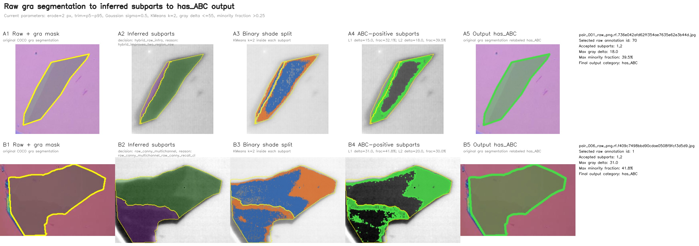
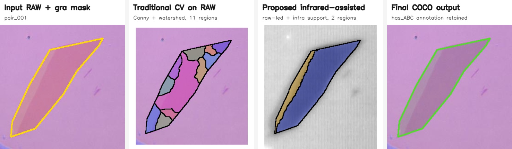

# 本科生毕业设计（论文）

题目：基于显微图像的石墨烯薄片自动分割与层数识别方法研究

姓名：________

学号：________

系别：物理系

专业：________

指导教师：________

年  月  日

## 诚信承诺书

本人郑重承诺所呈交的毕业设计（论文），是在导师的指导下，独立进行研究工作所取得的成果。除文中已经注明引用的内容外，本论文不包含任何其他人或集体已经发表或撰写过的作品或成果。对本论文研究作出重要贡献的个人和集体，均已在文中以明确方式标明。

作者签名：

年  月  日

# 基于显微图像的石墨烯薄片自动分割与层数识别方法研究

作者：________

（南方科技大学 物理系  指导教师：________）

## 摘要

石墨烯的层数、堆垛方式和局部形貌会显著影响其能带结构、光学响应与输运性质，因此在二维材料器件制备中，快速、稳定地从光学显微图像中找到目标薄片并判断层数具有重要意义。传统方法通常依赖人工显微镜筛选，再结合 Raman 光谱或 AFM 进行确认，虽然精度较高，但通量低、主观性强，难以满足大批量样品筛选需求。近年来，基于深度学习的二维材料识别方法开始被用于自动检测 flake，其中 MaskTerial 使用 Mask2Former 实例分割网络和光学对比度分类模块实现了较强的跨材料适配能力，为本文的分割模型提供了重要基础。

本文围绕石墨烯光学显微图像中的 flake 自动识别与层数，堆垛判定展开。首先，在 MaskTerial/Mask2Former 分割框架基础上，针对石墨烯显微图像中低对比度、小碎块和重复预测等问题，调整模型候选数、no-object 权重和训练策略，并设计后处理流程，对重叠或包含的预测 mask 进行合并，对低置信度、小面积和形状复杂度过高的预测进行过滤，使分割结果更接近人工标注。其次，针对传统 green-channel contrast 方法受显微镜白平衡、背景不均匀和样品局部不均匀影响较大的问题，本文构建了局部背景校正的特征提取流程，并以加权线性回归作为 baseline。再次，本文提出 compact green ordinal boundary BCE 层数识别模型，将 green-channel contrast、flake 内部 contrast 分布宽度和白平衡参数共同输入一个小参数量的有序边界模型，直接优化相邻层数边界的判别。最后，本文针对 显微镜原图/红外灰度图 成对图像设计红外辅助 subpart 分割与 ABC 堆垛候选识别流程，将显微镜图像上的 graphene segmentation 自动配准到红外图像，并在segmentation上对图片内部层数不同的部分进行再次分割形成均匀的subpart，并在 subpart 内基于红外灰度二分类输出 `has_ABC` COCO 候选标签，最终得到显微图像中石墨烯样品薄片的层数以及是否有ABC的信息。

实验结果表明，在同一测试集上，原始对照模型 `graphene_mid_finetune_baseline_v7` 不使用后处理时虽然有较高 recall，但会产生大量碎片和重复预测，precision 仅为 4.1%，F1 为 7.7%，平均每张图有 94.75 个 false positive，split rate 为 75.4%。本文改进模型在不使用后处理时已将 F1 提升到 30.2%，FP/图降至 14.88；结合后处理后，最终 precision 提升到 67.0%，F1 提升到 67.2%，false positive 降至 1.55 个/图，split rate 降至 1.6%。层数识别方面，在 1-7 层任务上，本文 ordinal boundary BCE 模型为 84.2%，within-1 accuracy 达到 98.2%；在 1-9 层任务上仍取得 77.5% exact accuracy 和 98.6% within-1 accuracy； 极大延拓了石墨烯层数识别的范围和准确度(对比 Optical image analysis for graphene layer detection: Enhanced green channel methodology)。红外辅助流程基本可以实现先对块内进行不同层数的分割然后对于每一个分割对象自动推理出其是否含有ABC。结果说明本文方法能够对于实验室真实的显微镜数据进行更加准确的分割，并将分割出来的样品 green-channel 层数识别从低层范围拓展到更高层数范围，并为堆垛候选区域提供自动预筛选，为后续的Raman等流程提供准确性较高的初始筛选，极大提升筛选效率，减少人力消耗。

## ABSTRACT

The layer number, stacking order and local morphology of graphene strongly affect its band structure, optical response and transport properties. Therefore, fast and reliable flake detection and layer identification from optical microscope images are important for the fabrication of two-dimensional material devices. Conventional workflows rely on manual optical inspection followed by Raman spectroscopy or AFM confirmation. These methods are accurate but time-consuming and difficult to scale. Recent deep-learning methods, especially MaskTerial based on Mask2Former instance segmentation and contrast-based classification, provide a foundation for automated flake detection.

This thesis studies automatic graphene flake segmentation and layer recognition from optical microscope images. Based on the MaskTerial/Mask2Former framework, the segmentation pipeline is adapted to graphene images by reducing the number of object queries, increasing the no-object loss weight, adjusting the training schedule and introducing a post-processing procedure. The post-processing merges duplicated masks and filters predictions with low confidence, small area or high shape complexity. For layer recognition, a local green-channel feature extraction pipeline is designed to reduce the influence of non-uniform background and microscope white balance. A weighted linear regression model is first used as a baseline. Then, a compact ordinal boundary BCE model is proposed, which uses green-channel contrast, intra-flake contrast variation and white-balance parameters to directly optimize ordered layer boundaries. In addition, an infrared-assisted pipeline is designed for paired raw/infra images to infer subparts and produce `has_ABC` candidate annotations for possible stacking-related regions.

Experiments on the same test set show that the baseline model `graphene_mid_finetune_baseline_v7` without post-processing produces severe fragmentation and duplicated masks, with 4.1% precision, 7.7% F1 score, 94.75 false positives per image and a 75.4% split rate. Without post-processing, the improved model already increases the F1 score to 30.2% and reduces false positives to 14.88 per image. With post-processing, the final model improves precision to 67.0%, F1 score to 67.2%, reduces false positives to 1.55 per image and reduces the split rate to 1.6%. For layer recognition, the 1-3 layer WLS baseline reaches 86.2% exact accuracy and 100% within-one-layer accuracy, confirming that the green-channel contrast feature can be reproduced for low-layer graphene after local background and white-balance correction. On the 1-7 layer task, the WLS baseline reaches 75.4% exact accuracy, while the proposed ordinal boundary BCE model reaches 84.2% exact accuracy and 98.2% within-one-layer accuracy. When the WLS baseline is extended to the 1-9 layer task, its test exact accuracy drops to 64.8%, and its training self-fit accuracy is only 50.9%, indicating clear underfitting in the high-layer regime. On the same 1-9 layer task, the proposed model still reaches 77.5% exact accuracy and 98.6% within-one-layer accuracy. The infrared-assisted pipeline checks 23 inferred subparts in the current example set, accepts 14 subparts as stacking candidates and outputs 10 `has_ABC` COCO annotations. These results indicate that the proposed method extends green-channel-based layer recognition from the low-layer regime to a wider layer range and provides an automatic pre-screening tool for stacking-related candidates.

Keywords: graphene; two-dimensional materials; optical microscopy; instance segmentation; MaskTerial; optical contrast; layer recognition

## 目录

1. 绪论1.1 研究工作的背景和意义1.2 国内外研究现状1.3 主要研究内容1.4 论文结构组织
2. 石墨烯物理与光学识别基础2.1 石墨烯结构与层数相关性质2.2 光学显微成像与 green-channel contrast2.3 数据集与标注格式
3. 模型与方法3.1 MaskTerial 与 Mask2Former 分割框架3.2 本文的石墨烯分割改进3.3 Green-channel WLS baseline3.4 Compact ordinal boundary BCE 层数识别模型3.5 红外辅助 subpart 与 ABC 堆垛候选识别流程
4. 实验设计与结果分析4.1 实验设置与评价指标4.2 分割实验结果4.3 分割可视化分析4.4 层数识别实验结果4.5 红外辅助 ABC 堆垛候选识别结果4.6 误差来源与讨论
5. 总结与研究展望
   5.1 总结
   5.2 研究展望

参考文献
致谢

# 1. 绪论

## 1.1 研究工作的背景和意义

石墨烯是由碳原子以 sp2 杂化形成的二维蜂窝状晶格材料。单层石墨烯具有线性色散关系、高载流子迁移率、高机械强度和较强的光学透过率，是二维材料物理和纳米器件研究中的基础材料之一。随着层数增加，石墨烯逐渐从单层 Dirac 费米子体系过渡到少层石墨烯和类石墨体系，其电子能带、光学吸收、层间耦合和输运性质都会发生变化。对于双层和多层石墨烯，不同堆垛方式也会带来不同的物性，例如 AB 堆垛、ABC 堆垛以及扭转角引入的 moire 超晶格都可能导致新的低能电子结构。因此，在实验制备过程中，仅仅找到一片“石墨烯”是不够的，还需要进一步判断其层数和局部均匀性。

在二维材料器件制备中，机械剥离仍然是获得高质量石墨烯的重要方法。该方法能够产生晶体质量较高的薄片，但其随机性很强，同一张衬底上会同时出现不同层数、不同尺寸和不同形貌的 flake。实验人员通常需要在光学显微镜下反复扫描衬底，凭借颜色、对比度和形状经验筛选目标区域，再使用 Raman 光谱、AFM 或电学测量进行确认。这个流程的主要问题是人工筛选耗时较长，并且判断标准依赖显微镜光源、相机白平衡、衬底厚度和实验人员经验。对于需要大批量制备异质结、筛选少层样品或进行统计实验的研究而言，人工筛选会成为明显瓶颈。

因此，建立一个能够从显微镜图像中自动分割石墨烯 flake，并进一步给出层数预测的系统具有实际价值。自动分割可以减少人工搜索时间，层数识别可以提高后续 Raman 或 AFM 表征的效率。本文的目标不是完全替代高精度表征，而是构建一个适合实验室日常筛片的高通量预筛选工具：对可见 flake 给出 mask，对 1-7 层或 1-9 层范围给出层数预测，对不确定样本标记为需要人工复核。

## 1.2 国内外研究现状

石墨烯层数识别最直接的方法是 Raman 光谱和 AFM。Raman 光谱可以通过 G 峰、2D 峰位置、强度和线宽变化判断层数及缺陷情况；AFM 可以直接给出厚度和形貌信息。这些方法准确可靠，但需要逐点测量，时间成本高，不适合作为显微镜大范围扫描阶段的主工具。

另一类方法基于光学显微图像。由于石墨烯和 SiO2/Si 衬底之间存在薄膜干涉效应，不同层数会在 RGB 通道中表现出不同光学对比度。早期研究表明，合适氧化层厚度下单层和少层石墨烯可以直接在光学显微镜中观察到。后续工作进一步使用 green channel contrast 或 RGB contrast 对 1-3 层石墨烯进行经验判别。该方法速度快、设备要求低，但对显微镜参数、白平衡、照明均匀性和相机响应十分敏感，不同实验室之间很难直接复用同一套阈值。

近年来，深度学习方法开始被用于二维材料自动识别。MaskTerial 提出了一个面向二维材料 flake detection 和 classification 的基础模型框架。该工作使用改进的 Mask2Former 实例分割网络检测 flake，并结合基于 optical contrast 的 AMM/GMM 分类模块进行材料或厚度分类；同时通过合成数据预训练和少量真实数据 fine-tuning 提高模型对新材料的适配能力。MaskTerial 为本文提供了重要基础：一方面，其 Mask2Former 分割框架适合从复杂显微图像中提取 flake mask；另一方面，原始分类模块主要面向粗粒度或数据集定义的类别，本文需要针对石墨烯 1-7 层和 1-9 层进行更精细的层数识别，因此需要重新设计层数模型。

## 1.3 主要研究内容

本文主要完成以下工作。

第一，基于 MaskTerial/Mask2Former 框架训练石墨烯 flake 分割模型。针对本文数据中低对比度、小块和重复预测较多的问题，对原始配置进行修改，包括减少 object query 数量、提高 no-object 分类权重、调整 batch size、学习率和训练迭代策略。模型输出后进一步进行后处理，合并重复或包含关系明显的 mask，并过滤低置信度、小面积和形状复杂度过高的预测。

第二，构建 green-channel 层数识别 baseline。对每个 flake 的局部区域进行背景估计与校正，提取 normalized green-channel contrast 和白平衡参数，训练 class-balanced weighted least squares 回归模型，作为后续方法的对照组。

第三，提出 compact ordinal boundary BCE 层数识别模型。该模型只使用少量物理相关特征，包括 normalized delta G、flake 内部 contrast IQR 和白平衡参数。模型输出一个连续 score，并通过有序边界判断层数。损失函数直接优化每个相邻层数边界，从而更适合层数这种有序离散标签。

第四，搭建 segmentation + layer recognition 推理流程。输入显微镜图片文件夹后，系统先进行 flake segmentation，再对每个 mask 提取 green-channel 特征并预测层数，最终输出带层数标签的 COCO segmentation 文件和审计 CSV。

第五，探索红外图像辅助的 subpart 分割与 ABC 堆垛候选识别流程。对于同时具有 raw 光学图像、50 倍红外图像和 raw 图上 gra 标注的样本，本文将 raw segmentation 映射到红外图像坐标系，在 flake 内部进一步分割 subpart，并在每个 subpart 内基于红外灰度二分类判断是否存在可能对应不同堆垛的局部灰度区域。最终流程输出 `has_ABC` COCO 文件，用于后续人工或 Raman 复核。

## 1.4 论文结构组织

本文共分为五章。第一章介绍研究背景、相关工作和本文主要内容。第二章介绍石墨烯层数与堆垛相关物理性质，以及光学显微图像中 green-channel contrast 的来源。第三章介绍 MaskTerial/Mask2Former 分割框架、本文分割改进、WLS baseline、compact ordinal boundary BCE 层数识别方法以及红外辅助 subpart 与 ABC 堆垛候选识别流程。第四章给出实验设置、分割结果、层数识别结果、红外辅助流程可视化结果和误差分析。第五章总结本文工作，并讨论未来可改进方向。

# 2. 石墨烯物理与光学识别基础

## 2.1 石墨烯结构与层数相关性质

单层石墨烯由一个原子层厚度的碳原子蜂窝晶格组成，其低能电子结构可在 K 和 K' 谷附近近似为线性色散，因此常被用作研究二维 Dirac 费米子输运的模型体系。随着层数增加，层间耦合会改变能带结构。例如 AB 堆垛双层石墨烯具有不同于单层的低能色散，并可以通过外加垂直电场调控能隙；三层及以上石墨烯还可能出现 ABA、ABC 等不同堆垛方式，不同堆垛会带来不同的低能态密度、光学响应和输运行为。也就是说，层数和堆垛不是简单的形貌描述，而是决定器件物理性质的重要自由度。

这一点在摩尔超晶格器件中尤其明显。将两层石墨烯或石墨烯与其他二维材料按特定角度堆叠时，晶格失配或扭转角会形成长周期摩尔势，进而重构能带并诱导关联绝缘态、超导、异常霍尔效应等低温量子输运现象。课题组的研究方向也集中在低维材料及其异质结中的量子输运、拓扑量子物态、磁性、非常规超导和新奇异质结界面等问题[10]。在这类实验中，石墨烯薄片可能作为主要输运通道、接触电极、局域栅极或异质结中的关键层，其层数、面积、边界质量和洁净程度都会影响器件加工与最终测量。

在自旋输运相关研究中，石墨烯也具有重要作用。由于碳元素自旋轨道耦合较弱、核自旋背景较低，高质量石墨烯可以作为较长自旋弛豫长度的二维输运通道；同时，通过与磁性材料、强自旋轨道耦合材料或超导材料构成异质结，又可以研究邻近效应诱导的自旋、谷和拓扑输运现象。因此，在器件制备前快速找到合适层数和尺寸的石墨烯 flake，是后续微纳加工和低温输运测量的基础步骤。本文的图像识别工作并不直接测量这些量子输运现象，而是服务于样品制备前端：从显微图像中更高效地筛选出可能用于摩尔超晶格器件或自旋输运器件的候选薄片。

## 2.2 光学显微成像与 green-channel contrast

石墨烯虽然只有原子层厚度，但在 SiO2/Si 衬底上可以通过光学显微镜观察到。这主要来自石墨烯、SiO2 层和 Si 衬底之间的多层薄膜干涉。不同层数会改变反射光强，使 flake 区域与裸衬底区域在 RGB 通道中出现微弱但可测的对比度。

本文使用 green channel 作为层数识别的主要光学信号。对一个 flake，记背景校正后的 flake green intensity 为 \(G_{\mathrm{flake}}\)，局部背景 green intensity 为 \(G_{\mathrm{bg}}\)，则 normalized delta G 定义为

\[
\mathrm{ndg}=\frac{\Delta G}{G_{\mathrm{bg}}}
=\frac{G_{\mathrm{flake}}-G_{\mathrm{bg}}}{G_{\mathrm{bg}}}.
\]

在理想情况下，少层石墨烯的 \(\mathrm{ndg}\) 会随层数单调变化，因此可以用作层数判别特征。但是实际显微图像中存在三个问题。第一，不同拍摄设置会改变 white balance，导致同一层数的 contrast 发生整体偏移。第二，视野内照明并不完全均匀，背景可能存在缓慢变化。第三，flake 内部可能存在褶皱、污染或厚度不均匀，使单个平均值不能完全代表该 flake。因此，本文在使用 green-channel contrast 时同时加入白平衡参数和 flake 内部 contrast 分布宽度。

## 2.3 数据集与标注格式

本文使用 COCO segmentation 格式保存石墨烯显微图像标注。分割任务中，每个 annotation 对应一个 flake mask；层数任务中，category name 对应真实层数。白平衡信息由图片名解析得到，文件名前部数字块被转换为两个白平衡参数 \(wb1\) 和 \(wb2\)。例如，当图片名中前四个数字块可解析为 \(a,b,c,d\) 时，代码将其转为 \(wb1=a.b\)，\(wb2=c.d\)。

当前层数数据中 1-9 层数据较完整，但 5 层缺失。因此，对于监督训练，模型实际使用的类别为 \([1,2,3,4,6,7]\) 或扩展后的 \([1,2,3,4,6,7,8,9]\)。5 层不作为已监督学习到的类别。在推理时，5 层根据 4 层和 6 层 score median 进行插值，作为待人工复核的候选区间。这样的处理避免了把缺失标签误写成已经验证过的分类结果。

# 3. 模型与方法

## 3.1 MaskTerial 与 Mask2Former 分割框架

MaskTerial 是面向二维材料显微图像的自动 flake detection 和 classification 框架。其核心思想是将 flake 搜索拆成两个阶段：第一阶段用实例分割模型检测 flake mask，第二阶段对每个 flake 计算 optical contrast 并进行材料或厚度分类。该框架的分割部分基于 Mask2Former。Mask2Former 将图像特征输入 pixel decoder 和 transformer decoder，通过一组 object queries 预测 mask embedding 和类别概率。与传统逐像素 semantic segmentation 不同，Mask2Former 直接输出实例级 mask，因此适合处理一张显微图像中多个 flake 的情况。

训练时，Mask2Former 使用 Hungarian matching 将预测 query 与真实 mask 一一匹配。匹配代价通常同时考虑类别概率、mask binary cross entropy 和 dice overlap，使每个真实 flake 尽量匹配到一个最合适的 query。匹配完成后，训练损失可写成

\[
L_{\mathrm{seg}}=\lambda_{\mathrm{cls}}L_{\mathrm{cls}}+\lambda_{\mathrm{bce}}L_{\mathrm{mask\_bce}}+\lambda_{\mathrm{dice}}L_{\mathrm{dice}}.
\]

其中 \(L_{\mathrm{cls}}\) 是 query 的类别交叉熵，包含真实类别和 no-object 类；\(L_{\mathrm{mask\_bce}}\) 在采样点上约束 mask logits 的前景/背景概率；\(L_{\mathrm{dice}}\) 则直接优化预测 mask 与真实 mask 的区域重叠。未匹配到真实 flake 的 query 被视为 no-object。对于本文的石墨烯数据，许多显微镜视野中真实 flake 数量并不多，如果 object query 数过大，模型会有更多 query 可以输出低质量重复候选；如果 no-object 权重过低，模型对无效候选的惩罚不足。因此，本文的分割改进首先从 query 数和 no-object 权重入手。

MaskTerial 原始框架还包含 AMM/GMM 分类头，用于根据 optical contrast 对 flake 做粗分类。本文曾尝试将层数数据重标为低层、中层、厚层三类并训练 AMM/MLP 粗分类模型，但结果显示 AMM 对低层召回不足，MLP 虽然能较好地区分 low-vs-rest，但中层与厚层仍有明显混淆。因此，本文最终不采用 AMM 粗分类作为层数识别主方法，而是保留 Mask2Former 作为分割基础，并单独设计 green-channel ordinal layer recognition。

## 3.2 本文的石墨烯分割改进

本文使用的 baseline config 为 `configs/M2F/config_baseline.yaml`，改进 config 为 `configs/M2F/base_config.yaml`。两者的关键差异见表 3-1。

表 3-1 分割配置主要差异

| 参数                   |  baseline |       本文改进 | 作用                                                               |
| ---------------------- | --------: | -------------: | ------------------------------------------------------------------ |
| `NUM_OBJECT_QUERIES` |       100 |             20 | 减少无效候选和重复预测，使 query 数更接近单张图像中实际 flake 数量 |
| `NO_OBJECT_WEIGHT`   |       0.1 |            0.4 | 增强对 no-object query 的惩罚，降低低质量假阳性                    |
| `IMS_PER_BATCH`      |        16 |             32 | 提高训练 batch size，改善梯度估计稳定性                            |
| `BASE_LR`            |      1e-5 |           5e-5 | 在 fine-tuning 中提高学习率，加快适配                              |
| `MAX_ITER`           |     12000 |          12000 | 训练迭代数                                                         |
| LR scheduler           | no warmup | WarmupCosineLR | 前期 warmup，后期平滑下降                                          |

这些参数对损失函数的影响主要体现在两方面。第一，`NUM_OBJECT_QUERIES` 从 100 降到 20 后，每张图像中参与 Hungarian matching 的候选 query 数量减少，未匹配 no-object query 的数量也随之减少。这不会改变单个 query 的损失形式，但会改变模型面对的候选空间：模型不再需要在大量空 query 中学习“多数都应该为空”，也减少了多个 query 同时覆盖同一 flake 的机会。第二，`NO_OBJECT_WEIGHT` 从 0.1 提高到 0.4 后，分类交叉熵中 no-object 类的权重增大。对于未匹配 query，如果模型仍给出较高 flake 概率，\(L_{\mathrm{cls}}\) 会受到更强惩罚，因此低质量假阳性和重复 mask 更容易在训练中被压低。`IMS_PER_BATCH` 与 `BASE_LR` 不直接改变损失函数公式，但会改变优化过程：更大的 batch size 使梯度估计更稳定，更高 learning rate 配合 warmup cosine schedule 使 fine-tuning 更快适配石墨烯数据，同时避免训练前期更新过猛。

模型直接输出的 mask 仍可能存在重复、包含、小碎片和形状异常等问题。因此，本文加入了基于规则的后处理。第一，对两个预测 mask 计算 IoU 和 containment。如果 IoU 大于 0.5，或者较小 mask 被较大 mask 覆盖比例超过 0.8，则认为二者是同一 flake 的重复预测，并进行 union 合并。第二，对最终 flake 进行过滤：score 需要大于 0.015，面积需要大于 100 \(\mu m^2\)，形状复杂度需要小于 5.0。形状复杂度定义为

\[
C=\frac{P^2}{4\pi A},
\]

其中 \(P\) 是 mask 周长，\(A\) 是 mask 面积。圆形或紧凑形状的 \(C\) 接近 1，细长、破碎或边界极不规则的预测会得到更大的 \(C\)。这一指标可以过滤由噪声、边缘伪影或错误分割产生的碎片。

该后处理流程的可视化效果在第 4.2 节与分割定量结果一并展示。

## 3.3 Green-channel WLS baseline

为了建立可解释的对照组，本文首先实现 green-channel weighted least squares baseline。其特征提取与后续 ordinal model 使用同一套预处理流程，保证比较公平。对每个 flake，先根据 bbox 外扩得到局部 ROI，再排除所有标注 flake mask 及其 dilation 区域，得到背景候选像素。对背景 green channel 使用双边滤波，并在背景候选中寻找主峰附近像素，拟合一阶背景平面

\[
G_{\mathrm{bg}}(x,y)=ax+by+c.
\]

为了降低杂质或其他 flake 对背景拟合的影响，背景平面拟合使用 residual sigma clipping。先拟合一次平面，计算 residual，再删除偏离中位 residual 超过若干倍 robust sigma 的背景点，重复迭代后得到更稳定的背景估计。

对于 flake 区域，本文比较了 peak、median、trimmed median、central median 和 largest inner median 等代表值。最终 baseline 使用 largest inner median，即先对 flake mask 腐蚀，取内部最大连通区域，再计算背景校正后 green residual 的中位数。该方法可以减少边缘混合像素和局部噪声的影响。

WLS baseline 使用的输入特征为

\[
x=[\mathrm{ndg}_{\mathrm{largest\_inner\_median}}, wb1].
\]

回归模型为

\[
\hat{y}=\beta_0+\beta_1 \mathrm{ndg}_{\mathrm{largest\_inner\_median}}+\beta_2 wb1.
\]

训练时使用 class-balanced sample weight，以减弱不同层数样本量不均衡的影响。设训练集样本总数为 \(N\)，训练集中实际出现的层数类别数为 \(K\)，第 \(c\) 层样本数为 \(n_c\)。对于真实层数 \(y_i=c\) 的样本，其权重定义为

\[
\omega_i=\omega_{y_i}=\frac{N}{K n_{y_i}}.
\]

因此，每个类别的总权重大致相同：

\[
\sum_{i:y_i=c}\omega_i
=n_c\frac{N}{K n_c}
=\frac{N}{K}.
\]

WLS baseline 实际优化的目标函数为

\[
\min_{\beta_0,\beta_1,\beta_2}
\sum_{i=1}^{N}
\omega_i
\left(
y_i-\beta_0-\beta_1 \mathrm{ndg}_i-\beta_2 wb1_i
\right)^2.
\]

预测时先得到连续 score \(\hat{y}_i\)，再映射到距离最近的有效层数类别：

\[
\hat{c}_i=\arg\min_{c\in\mathcal{C}}|\hat{y}_i-c|,
\]

其中 \(\mathcal{C}\) 是当前实验使用的有效层数集合，例如 \([1,2,3]\)、\([1,2,3,4,6,7]\) 或 \([1,2,3,4,6,7,8,9]\)。

## 3.4 Compact ordinal boundary BCE 层数识别模型

WLS baseline 的优点是简单、可解释，但它本质上优化连续层数数值的均方误差。对于层数分类任务，score 靠近真实层数并不一定代表边界判别正确。例如真实层数为 3 时，score 为 3.45 和 3.55 在 MSE 上差别不大，但如果 3/4 边界位于二者之间，则会导致完全不同的分类结果。因此，本文将层数识别重新表述为有序边界判别问题。

模型输入四个基础特征：

\[
x=[\mathrm{ndg},\mathrm{iqr\_ndg},wb1,wb2].
\]

其中

\[
\mathrm{iqr\_ndg}=\frac{P_{90}(G_{\mathrm{flake}}-G_{\mathrm{bg}})-P_{10}(G_{\mathrm{flake}}-G_{\mathrm{bg}})}
{|G_{\mathrm{bg}}|}.
\]

`iqr_ndg` 描述 flake 内部 contrast 分布宽度，可反映厚度不均匀、污染或边缘混入带来的不确定性。对训练集拟合均值和标准差后，输入特征被标准化为

\[
z=\frac{x-\mu_{\mathrm{train}}}{\sigma_{\mathrm{train}}}.
\]

然后构造固定的 7 维特征映射：

\[
\phi(x)=
[z_{\mathrm{ndg}},
z_{\mathrm{ndg}}^2,
z_{\mathrm{iqr}},
z_{wb1},
z_{wb2},
z_{\mathrm{ndg}}z_{wb1},
z_{\mathrm{ndg}}z_{wb2}].
\]

其中 \(z_{\mathrm{ndg}}^2\) 允许 green contrast 与层数之间存在轻微非线性，交互项 \(z_{\mathrm{ndg}}z_{wb1}\) 和 \(z_{\mathrm{ndg}}z_{wb2}\) 用来描述白平衡对 contrast 斜率的调制。

模型输出共享连续 score：

\[
s_i=w^T\phi(x_i)+b.
\]

对于有效类别 \([1,2,3,4,6,7]\)，定义有序边界 \([2,3,4,6,7]\)。每个边界 \(B_j\) 表示 \(y\ge b_j\)。边界 logit 为

\[
a_{ij}=s_i-\theta_j.
\]

真实标签被转为 boundary targets：

\[
t_{ij}=
\begin{cases}
1, & y_i\ge b_j,\\
0, & y_i<b_j.
\end{cases}
\]

训练损失为 margin ordinal BCE：

\[
L=
\frac{1}{N}\sum_i \omega_{y_i}
\sum_j \lambda_j
\left[
t_{ij}\operatorname{softplus}(m-a_{ij})
+(1-t_{ij})\operatorname{softplus}(a_{ij}+m)
\right]
+\gamma ||w||^2.
\]

其中 \(\omega_y\) 是 class-balanced sample weight，\(\lambda_j\) 是边界权重，\(m\) 是 margin，\(\gamma\) 是 L2 正则化强度。该损失的含义是：如果样本应该跨过某个边界，则希望 \(a_{ij}>m\)；如果样本不应该跨过该边界，则希望 \(a_{ij}<-m\)。当预测错得更远时，会跨错更多边界，因此损失自然增大。

为了保证阈值顺序合法，模型不直接优化 \(\theta_j\)，而是优化 raw 参数，并通过 softplus gap 生成单调递增阈值：

\[
\theta_1=r_0,\quad
\theta_j=\theta_{j-1}+\operatorname{softplus}(r_{j-1})+\epsilon.
\]

预测时统计 score 跨过的边界数，并映射回有效层数。对于缺失的 5 层，不参与训练；推理阶段可根据 4 层和 6 层 train score median 进行线性插值，作为复核区间。

## 3.5 红外辅助 subpart 与 ABC 堆垛候选识别流程

除常规光学图像中的 flake segmentation 和层数识别外，本文还针对 显微镜原图/红外图像 成对图像设计了红外辅助分析流程。该任务的输入是一组同一 flake 的显微镜原图和 50 倍红外图像，其中标注只给在显微镜原图上的 `graphene` segmentation。目标不是重新训练一个端到端深度网络，而是在已有显微镜原图标注基础上，自动得到红外坐标系下的 subpart 划分，并进一步判断每个 flake 内部是否存在可能对应 ABC 堆垛或局部堆垛差异的灰度区域。最终输出仍采用 COCO segmentation 格式：若某个原始 `graphene` segmentation 中至少一个 subpart 通过 ABC 候选判断，则保留该原始 segmentation，并将其类别写为 `has_ABC`；否则该 segmentation 不写入输出文件。

整个流程由两级判断组成。第一级是 subpart 分割。首先根据算法根据显微镜原图 mask 的形状在红外图像中自动寻找对应的 flake 区域。具体而言，先在红外灰度图中通过多阈值、形态学开闭运算和连通域过滤生成候选 mask，再用归一化形状 IoU 与 显微镜原图的graphene union 做匹配，选择代价最低的红外目标区域。得到 raw 区域和 infra 区域后，用二者外接框估计仿射变换，将 显微镜原图的segmentation 和显微镜原图证据映射到红外坐标系。

在 subpart 划分中，本文采用显微镜原图主导、红外图像补充的策略。显微镜原图更接近人眼观察结果，因此首先从显微镜原图的 LAB 亮度校正、RGB 单通道和多通道 Canny 边界中提取候选分割；红外图像虽然在复杂区域中能显露更多内部结构，但容易受到堆垛整体灰度、条纹和阴影影响，直接按红外强度分层会产生过碎区域。因此 infrared intensity candidate 主要作为边界证据和评分依据，而不是无条件替代显微镜原图的分割。

最终分割器只保留三类清晰的候选路径。第一类是 raw-warp seed，即先在显微镜原图 mask 内做初始 subpart 划分，再通过仿射变换映射到红外坐标系。第二类是 `merge_to_one`，当 raw-warp 产生多个区域、但红外边界梯度较弱且 raw-warp 在红外灰度中的区域内方差已经较低时，算法将整个 flake 合并为一个 subpart，用于抑制简单块过分割。第三类是 raw-warp 与 infrared evidence 形成的 hybrid candidate：算法先用红外灰度分位数生成一个低复杂度 evidence map，再与 raw-warp label 求交集；如果交集产生的小区域面积低于阈值，则通过最近邻 label 填充和相邻区域合并去除碎片，最后把区域数合并回 raw-warp 的区域数。这个过程的本质是让红外图像移动或修正 raw 边界，而不是让红外图像自由决定区域数量。

对于复杂块，算法额外生成 raw multi-channel Canny candidate。具体做法是将显微镜原图的 gray、LAB 亮度校正通道以及 RGB 单通道映射到红外坐标系，并分别做 robust normalize 后运行 Canny。当前 compact 流程保留三种 Canny 子模式：`raw_canny_vote3` 要求多个通道同时出现边缘，适合 raw 初始区域数较少但存在漏切的情况；`raw_canny_lcorr_closed` 只使用亮度校正通道并进行较强闭合，适合低对比度但连续的真实边界；`raw_canny_recall_clean` 先做高召回边界，再要求靠近 gray/Lcorr/G 等较干净通道的支持，用于复杂块中较难分辨的弱边界。Canny 边界膨胀后从 flake mask 中扣除，剩余连通域即为候选 subpart；小连通域会被过滤，未标记空洞由最近邻 label 填充。最终 selector 使用 raw-channel 区域内方差、小区域惩罚、区域数惩罚和候选边界上的 Canny edge support 做 gate。只有当 Canny candidate 比当前 final 的 raw-channel score 明显更低，并且边界支持足够高时才接管；同时它不能覆盖 `merge_to_one` 这类保守决策。这样的设计使流程在简单块上保持保守，在复杂块中利用 raw/Canny 边界补充分割能力。

第二级是 subpart 内 ABC 堆垛候选判断。对每个最终 subpart，算法在红外灰度图内进行局部二分类。首先将 subpart mask 向内腐蚀 2 个像素，以去除边界配准误差、混合像素和黑边；如果腐蚀后有效像素少于最小阈值，则回退到原 mask，避免小 subpart 被完全腐蚀掉。随后在有效像素上计算原始红外灰度的 5% 和 95% 分位数，只保留中间 90% 像素参与分类。这样做不是为了改变色块结构，而是为了去掉少量极亮点、极暗边缘或背景混入像素。

在分类阶段，算法对红外灰度做轻微 Gaussian 平滑（\(\sigma=0.5\)），然后在有效像素的一维灰度值上强制运行 \(k=2\) 的 KMeans。也就是说，每个像素的特征只有一个数值 \(I_{\mathrm{smooth}}\)，KMeans 优化目标为

\[
\min_{\{c_1,c_2\}}\sum_i \min_{j\in\{1,2\}}\left(I_i-c_j\right)^2.
\]

本文使用 KMeans++ 初始化，多次重复后选择 compactness 最低的结果。聚类完成后，两类按照中心值从暗到亮重新编号；随后统计每一类在原始红外灰度上的 mean、median、5%/95% 分位数、像素面积比例、连通域数量和最大连通域面积。最终是否接受 ABC 候选不直接看 KMeans compactness，而是看两个可解释条件：第一，两类原始灰度中位数差 \(\Delta I_{\mathrm{median}}\) 不能超过 55；第二，较小类占有效像素比例必须大于 0.25。灰度差上限用于排除黑边、反光、背景混入等极端差异；minority 比例下限用于避免少量噪声点或边缘残留被误判为有效堆垛区域。如果某个原始 `graphene` segmentation 中至少一个 subpart 通过这些条件，则输出 COCO 中保留该原始 segmentation，并将类别写为 `has_ABC`。

该流程具有两个特点。第一，它可以直接接在segmentation模型的后面，不需要任何人工的参与，所有切换都由 raw/infra 图像证据、区域数和无监督评分自动决定。第二，输出 `has_ABC` 时保留的是输入 raw COCO 中的原始 `gra` segmentation，而不是红外坐标系下的临时 subpart mask。这使得结果可以直接回到常规样品筛选标注体系中，作为“该 flake 大概率 包含 ABC 堆垛区域，需要进一步 Raman 或人工复核”的候选标签。

# 4. 实验设计与结果分析

## 4.1 实验设置与评价指标

分割实验使用石墨烯 COCO segmentation 数据集，baseline config 为 `configs/M2F/config_baseline.yaml`，改进 config 为 `configs/M2F/base_config.yaml`。标准评价指标采用 COCO segmentation AP、AP50、AP75，并按 flake 面积分区统计。但是在实际筛片场景中，AP/AP50 不能完全反映模型输出的可用性：如果一个真实 flake 被切成多个碎片，模型仍可能在 AP50 中得到部分匹配；如果测试集标注存在漏标，模型找到未标注但肉眼可见的 flake 时也会被计为 false positive。因此，本文额外统计实例级可用性指标。

实例级指标以 IoU=0.5 的一对一匹配为基础，计算 true positive、false positive、false negative、precision、recall 和 F1。为了衡量原始模型常见的碎片化问题，本文还统计每张图的 false positive 数量、split rate 和平均碎片数。split rate 表示被多个显著预测 mask 覆盖的真实 flake 比例；平均碎片数表示每个被命中的真实 flake 平均对应多少个显著预测 mask。这组指标更直接反映实验人员在显微镜筛片时需要面对多少噪声候选，以及一个 flake 是否被重复切碎。

层数识别实验使用 `white_balance_copy_layers.v10-argmented-10x.coco-segmentation` 数据集。1-7 层 ordinal 模型对应输出目录 `training_log/green_ordinal_largest_inner_median_v10`；1-9 层 ordinal 模型对应输出目录 `training_log/green_ordinal_largest_inner_median1_9`；1-3 层 WLS baseline 对应 `training_log/wls_baseline_largest_inner_wb1_1_3`；1-7 层 WLS baseline 对应 `training_log/wls_baseline_largest_inner_wb1_v10`；1-9 层 WLS baseline 对应 `training_log/wls_baseline_largest_inner_wb1_1_9`。评价指标包括 exact accuracy、within-1 accuracy、MAE、macro-F1、large error rate 和 review rate。

## 4.2 分割实验结果

表 4-1 给出了本文最终采用的分割对照。为了区分模型配置修改和后处理的贡献，本文同时比较四组结果：原始模型无后处理、原始模型加后处理、改进模型无后处理、改进模型加后处理。其中，原始模型为 `graphene_mid_finetune_baseline_v7`，改进模型为 `graphene_mid_finetune_remove_small_flakes_obj20`。四组结果使用同一测试集和同一套实例级评价脚本，因此可以直接比较输出可用性。

表 4-1 最终分割模型与 baseline 对照

| 模型                                                | 推理设置    | 图像数 | 标注数 | 预测数 | 准确率 |
| --------------------------------------------------- | ----------- | -----: | -----: | -----: | -----: |
| `graphene_mid_finetune_baseline_v7`               | 原始模型    |     40 |    187 |   3950 |   4.1% |
| `graphene_mid_finetune_baseline_v7`               | 本文后处理  |     40 |    187 |    214 |  56.5% |
| `graphene_mid_finetune_remove_small_flakes_obj20` | 改进后      |     40 |    187 |    734 |  18.9% |
| `graphene_mid_finetune_remove_small_flakes_obj20` | 改进+后处理 |     40 |    187 |    188 |  67.0% |

表 4-1a 原始模型与改进后模型对照

| 模型                                                | 推理设置 | 图像数 | 标注数 | 预测数 | 准确率 |
| --------------------------------------------------- | -------- | -----: | -----: | -----: | -----: |
| `graphene_mid_finetune_baseline_v7`               | 原始模型 |     40 |    187 |   3950 |   4.1% |
| `graphene_mid_finetune_remove_small_flakes_obj20` | 改进后   |     40 |    187 |    734 |  18.9% |

表 4-1b 原始模型与改进后模型加后处理对照

| 模型                                                | 推理设置    | 图像数 | 标注数 | 预测数 | 准确率 |
| --------------------------------------------------- | ----------- | -----: | -----: | -----: | -----: |
| `graphene_mid_finetune_baseline_v7`               | 原始模型    |     40 |    187 |   3950 |   4.1% |
| `graphene_mid_finetune_remove_small_flakes_obj20` | 改进+后处理 |     40 |    187 |    188 |  67.0% |

从表 4-1 可以看出，baseline 并不是完全找不到 flake。它的 recall 达到 85.6%，说明模型确实覆盖了许多真实目标；但这种召回是通过极大量候选实现的。40 张图中 baseline 输出 3950 个预测，其中 3790 个是 false positive，平均每张图 94.75 个 false positive，precision 只有 4.1%，F1 只有 7.7%。同时，split rate 达到 75.4%，每个命中的真实 flake 平均对应 10.20 个显著预测碎片。这说明原始模型输出虽然可能在 AP50 或 hit 类指标上覆盖到目标，但实际使用时会给实验人员带来大量重复、小碎片和噪声候选。

首先，比较两组无后处理结果可以看到模型配置修改本身的收益。`graphene_mid_finetune_remove_small_flakes_obj20` 在不使用后处理时，预测数量从 baseline 的 3950 降到 734，FP/图从 94.75 降到 14.88，split rate 从 75.4% 降到 38.5%，precision 从 4.1% 提升到 18.9%，F1 从 7.7% 提升到 30.2%。这说明减少 object query、提高 no-object 权重以及针对小碎片调整训练策略后，模型原始输出已经显著减少了无效候选和重复碎片。与此同时，recall 从 85.6% 降到 74.3%，说明模型不再像 baseline 那样用大量低质量候选去覆盖目标，而是输出更保守、更干净的候选集合。

其次，比较同一模型加后处理前后的结果可以看到后处理的收益。对于 baseline，后处理将预测数量从 3950 降到 214，FP/图从 94.75 降到 2.33，split rate 从 75.4% 降到 0.5%，F1 从 7.7% 提升到 60.3%。对于改进模型，后处理将预测数量从 734 降到 188，FP/图从 14.88 降到 1.55，split rate 从 38.5% 降到 1.6%，F1 从 30.2% 提升到 67.2%。这说明 overlap merge、面积过滤、score 过滤和形状复杂度过滤能够有效把重复 mask 和小碎片清理掉，使每个真实 flake 对应更接近单个完整预测。

最终，`graphene_mid_finetune_remove_small_flakes_obj20` 加本文后处理取得四组中最好的综合结果。相比 baseline 无后处理，最终方法的 precision 从 4.1% 提升到 67.0%，F1 从 7.7% 提升到 67.2%，FP/图从 94.75 降到 1.55，split rate 从 75.4% 降到 1.6%。虽然 recall 从 85.6% 降至 67.4%，但这是由于本文方法主动过滤低置信度、小面积和形状复杂度过高的碎片候选。对于实验室筛片任务，更重要的是输出少量、相对完整、可人工快速复核的候选 flake，而不是输出大量破碎 mask。该结果说明，本文分割改进由两部分组成：模型配置修改负责提高原始候选质量，后处理负责进一步合并重复预测并过滤无效碎片。

## 4.3 分割可视化分析

从可视化观察，改进后的模型能够较好捕捉肉眼可见的石墨烯 flake，尤其是边界较清晰、面积较大的 flake。后处理对重复 mask 的合并和小碎片过滤也使输出更接近人工标注。

图 4-1 给出了同一张测试图像在手工标注、原配置预测和改进配置加后处理预测下的可视化对比。手工标注中，图像内主要标出了少数肉眼可辨认且形状相对完整的石墨烯 flake。原配置预测结果中，模型输出了大量低置信度小色块，多个预测 mask 彼此接近或重叠，且存在一些面积很小、形状破碎的候选区域。这类输出虽然在数值上可能包含部分真实 flake，但对实际筛片并不友好，因为实验人员仍需要从大量噪声候选中手动判断有效样品。改进配置和后处理后的结果明显减少了碎片化预测和重复预测，保留的 flake 数量与手工标注更接近，且主要集中在较清晰的候选区域。该对比直观说明，减少 object query、提高 no-object 权重以及后处理过滤共同提高了分割结果的可用性。

图 4-1 石墨烯分割可视化对比

| 手工标注                                      | 原配置预测                                                | 改进配置 + 后处理                                                    |
| --------------------------------------------- | --------------------------------------------------------- | -------------------------------------------------------------------- |
|  |  |  |

## 4.4 层数识别实验结果

表 4-2 给出了 WLS baseline 与本文 ordinal boundary BCE 模型在测试集上的对比。

表 4-2 层数识别测试集指标

| 模型         | 类别范围        |  n | Exact Acc. | Within-1 Acc. |   MAE | Macro-F1 | Large Error Rate | Review Rate |
| ------------ | --------------- | -: | ---------: | ------------: | ----: | -------: | ---------------: | ----------: |
| WLS baseline | 1,2,3           | 29 |      86.2% |        100.0% | 0.138 |    0.857 |            0.00% |           - |
| WLS baseline | 1,2,3,4,6,7     | 57 |      75.4% |         98.2% | 0.263 |    0.752 |            1.75% |           - |
| WLS baseline | 1,2,3,4,6,7,8,9 | 71 |      64.8% |         98.6% | 0.366 |    0.616 |            1.41% |           - |
| Ordinal BCE  | 1,2,3,4,6,7     | 57 |      84.2% |         98.2% | 0.175 |    0.842 |            1.75% |       15.8% |
| Ordinal BCE  | 1,2,3,4,6,7,8,9 | 71 |      77.5% |         98.6% | 0.239 |    0.772 |            1.41% |       18.3% |

首先，1-3 层 WLS baseline 在测试集上达到 86.2% exact accuracy 和 100% within-1 accuracy，说明在本文数据和预处理流程下，文献中利用 green-channel contrast 判断低层石墨烯的思路是可以复现的。也就是说，本文并不是否定 green-channel 特征本身；相反，实验表明经过局部背景拟合、largest-inner-median flake 代表值和白平衡参数校正后，green-channel contrast 对 1-3 层仍然是有效特征。

在 1-7 层任务上，本文 ordinal model 相比 WLS baseline 将 exact accuracy 从 75.4% 提升到 84.2%，MAE 从 0.263 降低到 0.175，macro-F1 从 0.752 提升到 0.842。within-1 accuracy 两者都达到 98.2%，说明 green-channel contrast 已经能够提供较好的大致层数排序，而 ordinal boundary BCE 进一步改善了相邻层数的边界判别。

当类别范围扩展到 1-9 层后，WLS baseline 的 exact accuracy 降至 64.8%，macro-F1 降至 0.616，明显低于 ordinal BCE 的 77.5% 和 0.772。更重要的是，1-9 WLS baseline 在训练集上的 self-fit exact accuracy 也只有 50.9%，within-1 accuracy 为 95.1%。这说明它的问题不是测试集过拟合或数据划分偶然性，而是单一线性函数无法同时拟合低层和高层的层数边界，即存在模型欠拟合。换言之，线性回归仍能保持较高 within-1 accuracy，是因为 \(\mathrm{ndg}\) 与层数总体仍近似单调；但它无法把高层相邻类别的 exact boundary 放到正确位置，因此不适合作为 1-9 层精确识别的最终模型。本文的主要改进正是在保留 green-channel 物理特征可解释性的基础上，将可用识别范围从传统低层范围扩展到至少 1-7 层，并在 1-9 层扩展实验中仍保持较好的识别能力。

该模型还提供 review flag。当样本 score 离任一边界过近，或者落入缺失 5 层插值区间时，模型会标记为需要人工复核。在 1-7 层模型中，review rate 为 15.8%；去掉 review 样本后，kept exact accuracy 达到 91.7%。这符合实验室应用需求：模型可以自动处理高置信样本，把低置信样本交给人工或 Raman/AFM 复核。

表 4-3 给出 1-9 层 WLS baseline 与 ordinal BCE 在高层段的测试集混淆情况。可以看到，WLS baseline 对真实 7 层完全失效：11 个真实 7 层样本没有任何一个被预测为 7 层，其中 7 个被低估为 6 层，3 个被高估为 8 层，1 个被高估为 9 层。相比之下，ordinal BCE 在真实 7 层上有 6/11 个预测正确，主要错误也集中在相邻的 6 层和 8 层。按 7-9 层高层段统计，WLS baseline 的 exact accuracy 为 \(11/25=44.0\%\)，ordinal BCE 为 \(16/25=64.0\%\)，提升 20 个百分点。这说明 ordinal BCE 明显缓解了线性模型在高层边界上的失效。

表 4-3 1-9 WLS baseline 与 ordinal BCE 高层段混淆统计

| 模型         | true layer | pred 6 | pred 7 | pred 8 | pred 9 |
| ------------ | ---------: | -----: | -----: | -----: | -----: |
| WLS baseline |          7 |      7 |      0 |      3 |      1 |
| WLS baseline |          8 |      0 |      1 |      4 |      2 |
| WLS baseline |          9 |      0 |      0 |      0 |      7 |
| Ordinal BCE  |          7 |      1 |      6 |      4 |      0 |
| Ordinal BCE  |          8 |      0 |      1 |      4 |      2 |
| Ordinal BCE  |          9 |      0 |      0 |      1 |      6 |

表 4-4 给出 1-7 层 ordinal BCE 模型的测试集混淆矩阵。

表 4-4 1-7 ordinal BCE 测试集混淆矩阵

| true layer | pred 1 | pred 2 | pred 3 | pred 4 | pred 6 | pred 7 |
| ---------: | -----: | -----: | -----: | -----: | -----: | -----: |
|          1 |      8 |      2 |      0 |      0 |      0 |      0 |
|          2 |      0 |      8 |      0 |      0 |      0 |      0 |
|          3 |      0 |      1 |     10 |      0 |      0 |      0 |
|          4 |      0 |      0 |      4 |      7 |      1 |      0 |
|          6 |      0 |      0 |      0 |      0 |      5 |      0 |
|          7 |      0 |      0 |      0 |      0 |      1 |     10 |

主要错误集中在 1/2、3/4 和 4/6 边界附近。其中 3/4 层混淆最明显，这与人工标注噪声和少层石墨烯 optical contrast 间隔较小有关。1-9 层模型的混淆矩阵进一步显示，7/8 和 8/9 之间也存在相邻层混淆，但几乎没有跨越两层以上的大错误。

表 4-5 给出训练集每层 score median。可以看到，随着层数增加，score 基本单调增大，说明模型学到的连续光学厚度分数具有合理物理含义。

| 模型            | layer 1 | layer 2 | layer 3 | layer 4 | layer 6 | layer 7 | layer 8 | layer 9 |
| --------------- | ------: | ------: | ------: | ------: | ------: | ------: | ------: | ------: |
| 1-7 Ordinal BCE |  -1.558 |   1.045 |   4.215 |   5.325 |  10.789 |  16.494 |       - |       - |
| 1-9 Ordinal BCE |  -3.577 |  -0.411 |   3.513 |   4.850 |  10.562 |  15.671 |  20.004 |  24.222 |

5 层由于当前训练集中没有标注样本，不参与监督训练。对于实际推理，本文仅根据 4 层和 6 层 score median 中间位置给出插值复核区间，不将其写成已验证类别。未来需要补充 5 层样本后重新训练，才能对 5 层 exact accuracy 做定量评价。

## 4.5 红外辅助 ABC 堆垛候选识别结果

为展示红外辅助流程的完整输出，本文使用当前最终参数在 raw/infra 成对数据上进行推理。输入为包含 raw 图像、infra 图像和 raw 图上 `gra` COCO 标注的数据文件夹；输出为新的 COCO 文件，其中通过 ABC 候选判断的原始 `gra` segmentation 被标记为 `has_ABC`。在当前样例数据中，流程共检查 23 个最终 subpart，其中 14 个 subpart 通过二分类灰度筛选；这些 accepted subpart 对应到 10 个原始 raw `gra` annotation，因此最终输出 COCO 中包含 10 个 `has_ABC` segmentation。需要强调的是，`has_ABC` 是基于红外灰度和空间连通性的图像候选标签，并不等价于 Raman 或电子输运意义上的最终堆垛确认。

图 4-2 给出两个样例从输入到输出的完整流程。第一列为 raw 图像及其原始 `gra` segmentation；第二列为在红外坐标系下推断出的 subpart；第三列为每个 subpart 内部的二分类灰度分区；第四列用绿色标出通过 ABC 候选判断的 minority class 区域；第五列回到 raw 图像坐标，显示最终写入 COCO 的 `has_ABC` segmentation。可以看到，该流程并不是直接在整块 flake 上按红外亮暗阈值粗暴分类，而是先进行 subpart 分割，再在每个 subpart 内判断是否存在相对细微且占据足够面积的局部灰度差异。这样可以在一定程度上区分“不同 subpart 本身层数不同”与“同一 subpart 内存在局部堆垛差异”这两种情况。

图 4-2 红外辅助 subpart 分割与 `has_ABC` 输出流程示例

为对比传统 CV 方法，本文选取 raw 图 Canny + watershed 作为代表性 baseline。该方法不使用红外图像和自动候选选择器，而是直接在 raw 图像上提取边缘并据此切分 flake。之所以选取该 baseline，是因为在前期实验中，Canny 边界相较直接阈值、kmeans 或单纯红外灰度分割更容易捕捉 raw 图中人眼可见的弱边界，属于传统 CV 方法中较有竞争力的一类。图 4-3 给出 pair_001 的对比结果。

图 4-3 pair_001 中 raw Canny + watershed 与本文红外辅助流程对比

从可视化可以看到，raw Canny + watershed 能够找到 flake 内部的一些弱边界，但缺少后续的区域可信度判断，容易把纹理、噪声和局部边缘响应切成多个小块。pair_001 中该方法将目标区域切成 11 个 region，而人工 subpart 标注为 2 个 region；本文方法在 raw 主导的基础上引入 infra 辅助和候选选择，最终保持为 2 个 region，并与人工 subpart 更一致。表 4-6 给出该样例上的定量指标。

表 4-6 pair_001 中传统 CV baseline 与本文方法对比

| 方法                                   | 输入信息     | 预测 region 数 | ARI   | Boundary F1 | 主要现象                        |
| -------------------------------------- | ------------ | -------------- | ----- | ----------- | ------------------------------- |
| raw Canny + watershed                  | raw RGB/gray | 11             | 0.084 | 0.087       | 能捕捉弱边界，但明显过分割      |
| 本文 compact raw-warp + infra 辅助流程 | raw + infra  | 2              | 0.842 | 0.624       | 保留主要 subpart 边界，抑制碎片 |

## 4.6 误差来源与讨论

本文方法的主要误差来源有两类。

第一，在segmentation模型的可视化中，我们可以看见模型找出了一些人眼在标注时忽略掉的flake, 但是在我们的指标中把它们定为false positive 因此最终模型的实际正确率会高于文中的67%。

第二，层数标注本身存在不确定性。许多样本的层数来自光学显微经验判断，而非逐个 flake 的 Raman 或 AFM 标定。对于 contrast 接近的相邻层数，人工标签可能也存在边界模糊。因此在构造模型的时候对于标注跨越的惩罚实际上算法是较为温和的，只有跨越两次边界的时候才加重惩罚，在训练的方法上就允许了一定的误差。

第三，红外辅助 ABC 堆垛候选识别是图像预筛选，而不是最终物性确认。红外图像中的灰度差可能同时来自堆垛方式、层数变化、局部污染、边缘厚度、照明不均匀和配准误差。因此，本文在算法上采用 raw 主导、infra 补充和二分类候选筛选，以减少直接红外阈值导致的过分割；但最终 `has_ABC` 标签仍应理解为需要进一步 Raman、AFM 或人工复核的候选标记。未来如果能够获得 Raman 确认的 ABC/非 ABC 标注，可进一步将该流程从无监督规则筛选升级为有监督判别模型。

# 5. 总结与研究展望

## 5.1 总结

本文围绕石墨烯显微图像自动识别，完成了 flake segmentation、layer recognition 和红外辅助 ABC 堆垛候选识别三部分工作。分割方面，本文以 MaskTerial/Mask2Former 为基础，对石墨烯数据进行 fine-tuning，并通过减少 object query 数、提高 no-object 权重、调整训练策略和设计后处理流程，提升了 flake mask 输出质量。实例级评估显示，原始 baseline `graphene_mid_finetune_baseline_v7` 无后处理时输出极度碎片化，precision 仅为 4.1%，F1 为 7.7%，平均每张图 94.75 个 false positive，split rate 为 75.4%。在不加后处理时，本文改进模型已经将 FP/图降至 14.88，F1 提升到 30.2%，说明模型配置修改改善了原始候选质量；进一步加入后处理后，最终 precision 达到 67.0%，F1 达到 67.2%，false positive 降至 1.55 个/图，split rate 降至 1.6%。这说明本文方法显著提升了实验室筛片场景下的输出可用性。

层数识别方面，本文首先实现了基于 green-channel contrast 和白平衡参数的 WLS baseline。该 baseline 在 1-3 层任务上达到 86.2% exact accuracy 和 100% within-1 accuracy，证明本文的特征提取流程能够复现低层 green-channel contrast 判据；但该 baseline 在 1-7 层任务上下降到 75.4% exact accuracy，扩展到 1-9 层后 test exact accuracy 进一步降至 64.8%，训练集 self-fit accuracy 也只有 50.9%，说明单一直线拟合难以描述高层段的层数-contrast 关系。随后本文提出 compact ordinal boundary BCE 模型，将层数识别视为有序边界判别问题。该模型只使用少量物理相关特征，参数量小，适合当前样本量有限的数据集。在 1-7 层任务上，模型 test exact accuracy 达到 84.2%，within-1 accuracy 达到 98.2%；在 1-9 层任务上，exact accuracy 达到 77.5%，within-1 accuracy 达到 98.6%。这些结果说明，结合局部背景校正、白平衡建模和有序边界损失，可以在保留 green-channel 特征物理可解释性的同时，将可靠识别范围从低层拓展到更高层数。

红外辅助分析方面，本文进一步构建了 显微镜图像/红外图像 成对图像的 subpart 分割和 `has_ABC` 候选输出流程。该流程以显微镜图像上的 graphene 标注为输入，自动配准到 50 倍红外图像，在显微镜图像主导、红外图像补充的原则下划分 subpart，再使用红外灰度二分类判断 subpart 内是否存在候选堆垛差异区域。当前测试数据中，流程基本上能和人工标注的subpart吻合并准确找出可能有ABC堆垛的flake。该结果说明，本文系统可以从常规 flake mask 进一步扩展到 subpart-level 的红外辅助候选筛选，为后续 Raman 或人工复核提供更聚焦的目标区域。

## 5.2 研究展望

本文仍有若干不足。首先，当前 5 层石墨烯样本缺失，因此模型目前没有对 5 层进行验证。未来应优先补充 5 层样本，继续进行训练。其次，当前层数标签主要来自光学经验判断，未来应使用 Raman、AFM 或已知器件结果对关键样本进行校准，建立更可靠的 ground truth，可能可以进一步提高精度，因为当前的算法因为人工标注的模糊性对损失函数进行了放宽处理。第三，分割模型和层数模型目前是串联流程，未来可以进一步结合 layer recognition review flag（代码在仓库里但是还没有加进流程，主要处于模糊边界的flake单独输出交由人工审核），形成更完整的自动筛片软件。

总体而言，本文方法能够在现有实验室显微镜图像中，实现石墨烯 flake 的自动分割，并在 1-7 层精确识别和 1-9 层扩展识别中取得优于线性 baseline 的结果，为二维材料制备流程自动化提供了可行基础。

# 参考文献

[1] Novoselov K S, Geim A K, Morozov S V, et al. Electric field effect in atomically thin carbon films[J]. Science, 2004, 306(5696): 666-669.

[2] Geim A K, Novoselov K S. The rise of graphene[J]. Nature Materials, 2007, 6: 183-191.

[3] Blake P, Hill E W, Castro Neto A H, et al. Making graphene visible[J]. Applied Physics Letters, 2007, 91: 063124.

[4] Novoselov K S, Mishchenko A, Carvalho A, Castro Neto A H. 2D materials and van der Waals heterostructures[J]. Science, 2016, 353(6298): aac9439.

[5] Cheng B, Misra I, Schwing A G, Kirillov A, Girdhar R. Masked-attention Mask Transformer for Universal Image Segmentation[C]. CVPR, 2022.

[6] Uslu O, et al. MaskTerial: A Foundation Model for Automated 2D Material Flake Detection[J]. Digital Discovery, 2025, 4: 3744. DOI: 10.1039/D5DD00156K.

[7] Sahriar M A, Rumman A H, Abed M R H, Nirjhar A R, Dipon M N A, Tan-Ema S J, et al. Optical image analysis for graphene layer detection: Enhanced green channel methodology[J]. Computational Materials Science, 2024, 244: 113198. DOI: 10.1016/j.commatsci.2024.113198.

# 致谢

首先感谢指导教师在课题选择、实验思路和论文写作中的指导。感谢课题组同学在石墨烯样品制备、显微镜拍摄和层数标注中的帮助。感谢 MaskTerial 项目作者公开代码、模型和数据资源，使本文能够在已有二维材料自动识别框架基础上开展进一步改进。最后感谢家人和朋友在本科阶段给予的支持。

<!--
后续待办：
1. 按学校 Word 模板调整标题样式、页眉页脚、目录页码、图表编号和公式编号。
2. 把最终采用的显微图像整理到 article/figures/，统一命名。
-->
